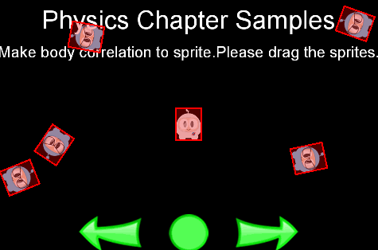
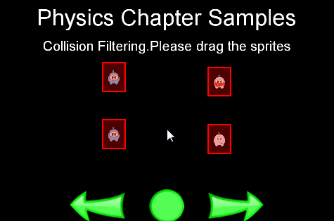
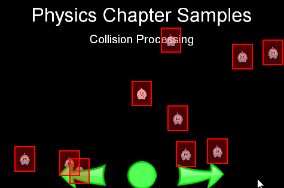
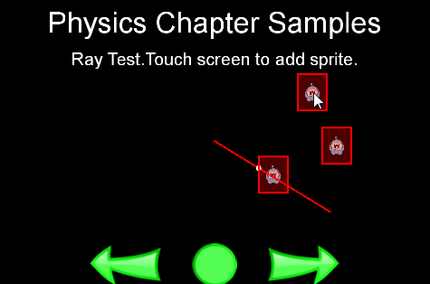

# Chapter 12: Physics

## What options and why integrated physics engine
Simulating a real physical world in a game can be a daunting task. Usually a
_physics engine_ can help make this easier. Cocos2d-x provides a _physics engine_
that is based on the popular _Chipmunk physics engine_.

## Physics terminology and concepts
### Bodies
A `PhysicsBody` holds the physical properties of an object these include _mass_,
_position_, _rotation_, _velocity_, _damping_, etc. `PhysicsBody` objects are the
backbone for shapes. A `PhysicsBody` does not have a shape until you attach a
shape to it.

### Material
Materials describe material attributes：
 >- density：It is used to compute the mass properties of the parent body.
 >- friction：It is used to make objects slide along each other realistically.
 >- restitution：It is used to make objects bounce. The restitution value is
 usually set to be between 0 and 1.

### Shapes
Shapes describe collision geometry. By attaching shapes to bodies, you define a
body’s shape. You can attach as many shapes to a single body as you need in order
to define a complex shape. Each shape relates to a `PhysicsMaterial` object and
contains the following attributes: _type_, _area_, _moment_, _tag_, _mass_ and
_offset_.

 >- `PhysicsShape`: Shapes implement the `PhysicsShape` base class.
 >- `PhysicsShapeCircle`: Circles are solid. You cannot make a hollow circle
 using the circle shape.
 >- `PhysicsShapePolygon`: Polygon shapes are solid convex polygons.
 >- `PhysicsShapeBox`: A Box shape is one kind of convex polygon.
 >- `PhysicsShapeEdgeSegment`: A segment shape.
 >- `PhysicsShapeEdgePolygon`: Hollow polygon shapes.A edge-polygon shape consists
 of multiple segment shapes.
 >- `PhysicsShapeEdgeBox`：Hollow box shapes.A edge-box shape consists of four
 segment shapes.
 >- `PhysicsShapeEdgeChain`: The chain shape provides an efficient way to connect
 many edges together.

### Contacts/Joints
_Contacts_ and _joints_ describe how bodies are attached to each other.

### World
A `World` container is what your physics bodies are added to and where they are
simulated. You add _bodies_, _shapes_ and _constraints_ to a world and then update
the world as a whole. The `World` controls how all of these items interact together.
Much of the interaction with the physics API will be with a `PhysicsWorld` object.

## Physics world, bodies
Now that we have had a bit of overview, let's jump right into the details.

### PhysicsWorld
Cocos2d-x providea a `PhysicsWorld` as the basic unit of simulation. `PhysicsWorld`
integrates deeply with `Scene`. You can create a `Scene` that is a `PhysicsWorld`
using:
```cpp
auto scene = Scene::createWithPhysics();
```
Every `PhysicsWorld` has properties associated with it:
 >- gravity: Global gravity applied to the world. Defaults to Vec2(0.0f, -98.0f).
 >- speed: Set the speed of physics world, speed is the rate at which the simulation
 executes. Defaults to 1.0.
 >- updateRate: set the update rate of physics world, update rate is the value of
 EngineUpdateTimes/PhysicsWorldUpdateTimes.
 >- substeps: set the number of substeps in an update of the physics world.

You can disable auto step of physics world by `PhysicsWorld::setAutoStep(false)`
and step physics world manually by `PhysicsWorld::step(time)`.

### PhysicsBody
`PhysicsBodies` have _position_ and _velocity_. You can apply _forces_, _movement_,
_damping_ and _impulses_ to `PhysicsBody` objects. `PhysicsBody` can be _static_ or
_dynamic_. A _static_ body does not move under simulation and behaves as if it has
infinite mass. A _dynamic_ body is fully simulated. They can be moved manually by
the user, but normally they move according to forces. A dynamic body can collide
with all body types. Cocos2d-x provide `Node::setPhysicsBody()` to associate a
`PhysicsBody` to a `Node` object.
Lets create a static `PhysicsBody` that contains a box shape:
```cpp
auto physicsBody = PhysicsBody::createBox(Size(65.0f, 81.0f),
						PhysicsMaterial(0.1f, 1.0f, 0.0f));
physicsBody->setDynamic(false);

//create a sprite
auto sprite = Sprite::create("whiteSprite.png");
sprite->setPosition(s_centre);
addChild(sprite);

//apply physicsBody to the sprite
sprite->setPhysicsBody(physicsBody);

//add five dynamic body
for (int i = 0; i < 5; ++i)
{
    physicsBody = PhysicsBody::createBox(Size(65.0f, 81.0f),
    				PhysicsMaterial(0.1f, 1.0f, 0.0f));

    //set the body isn't affected by the physics world's gravitational force
    physicsBody->setGravityEnable(false);

    //set initial velocity of physicsBody
    physicsBody->setVelocity(Vec2(cocos2d::random(-500,500),
    			cocos2d::random(-500,500)));
    physicsBody->setTag(DRAG_BODYS_TAG);

    sprite = Sprite::create("blueSprite.png");
    sprite->setPosition(Vec2(s_centre.x + cocos2d::random(-300,300),
    			s_centre.y + cocos2d::random(-300,300)));
    sprite->setPhysicsBody(physicsBody);

    addChild(sprite);
}
```
The result is a stationary `PhysicsBody` with 5 additional `PhysicsBody` objects
colliding around it.



## Collision
Collisions are what happens when `PhysicBody` objects come in contact with each
other.

### Filtering Collisions
Collision filtering allows you to prevent collision between shapes. Cocos2d-x
supports collision filtering using category and groups bitmasks.

Cocos2d-x supports 32 collision categories. For each shape you can specify which
category it belongs to. You also specify what other categories this shape can
collide with. This is done with masking bits. For example:
```cpp
auto sprite1 = addSpriteAtPosition(Vec2(s_centre.x - 150,s_centre.y));
sprite1->getPhysicsBody()->setCategoryBitmask(0x02);    // 0010
sprite1->getPhysicsBody()->setCollisionBitmask(0x01);   // 0001

sprite1 = addSpriteAtPosition(Vec2(s_centre.x - 150,s_centre.y + 100));
sprite1->getPhysicsBody()->setCategoryBitmask(0x02);    // 0010
sprite1->getPhysicsBody()->setCollisionBitmask(0x01);   // 0001

auto sprite2 = addSpriteAtPosition(Vec2(s_centre.x + 150,s_centre.y),1);
sprite2->getPhysicsBody()->setCategoryBitmask(0x01);    // 0001
sprite2->getPhysicsBody()->setCollisionBitmask(0x02);   // 0010

auto sprite3 = addSpriteAtPosition(Vec2(s_centre.x + 150,s_centre.y + 100),2);
sprite3->getPhysicsBody()->setCategoryBitmask(0x03);    // 0011
sprite3->getPhysicsBody()->setCollisionBitmask(0x03);   // 0011
```
You can text for collisions by checking and comparing _category_ and _collision_
bitmasks like:
```cpp
if ((shapeA->getCategoryBitmask() & shapeB->getCollisionBitmask()) == 0
   || (shapeB->getCategoryBitmask() & shapeA->getCollisionBitmask()) == 0)
{
   // shapes can't collide
   ret = false;
}
```


Collision groups let you specify an integral group index. You can have all shapes
with the same group index always collide (positive index) or never collide (negative
index and zero index). Collisions between shapes of different group indices are
filtered according the category and mask bits. In other words, group filtering has
higher precedence than category filtering.

### Contacts/Joints
Each joint type has a definition that derives from `PhysicsJoint`. All joints are
connected between two different bodies. One body may static.You can prevent the
attached bodies from colliding with each other by `joint->setCollisionEnable(false)`.
Many joint definitions require that you provide some geometric data. Often a joint
will be defined by anchor points.The rest of the joint definition data depends
on the joint type.

 >- PhysicsJointFixed: A fixed joint fuses the two bodies together at a reference
 point. Fixed joints are useful for creating complex shapes that can be broken
 apart later.
 >- PhysicsJointLimit: A limit joint imposes a maximum distance between the two
 bodies, as if they were connected by a rope.
 >- PhysicsJointPin: A pin joint allows the two bodies to independently rotate
 around the anchor point as if pinned together.
 >- PhysicsJointDistance: Set the fixed distance with two bodies
 >- PhysicsJointSpring: Connecting two physics bodies together with a spring
 >- PhysicsJointGroove: Attach body a to a line, and attach body b to a dot
 >- PhysicsJointRotarySpring: Likes a spring joint, but works with rotary
 >- PhysicsJointRotaryLimit: Likes a limit joint, but works with rotary
 >- PhysicsJointRatchet: Works like a socket wrench
 >- PhysicsJointGear: Keeps the angular velocity ratio of a pair of bodies constant
 >- PhysicsJointMotor: Keeps the relative angular velocity of a pair of bodies
 constant


### Collision detection
Contacts are objects created by physics mode to manage collision between two
shapes. The contact class is created and destroyed by physics mode. Contact objects
are not created by the user. Here is some terminology associated with contacts.
 - contact point: A contact point is a point where two shapes touch.
 - contact normal: A contact normal is a unit vector that points from one shape
 - to another.

You can get the shapes from a contact. From those you can get the bodies.
```cpp
bool PhysicsContactTest::onContactBegin(PhysicsContact& contact)
{
    PhysicsBody* bodyA = contact.getShapeA()->getBody();
    PhysicsBody* bodyB = contact.getShapeB()->getBody();
    return true;
}
```
You can get access to contacts by implement a contact listener. The contact
listener supports several events: _begin_, _pre-solve_, _post-solve_ and _separate_.

>- begin: Two shapes just started touching for the first time this step. Return
true from the callback to process the collision normally or false to cause physics
engine to ignore the collision entirely. If you return false, the _preSolve()_ and
_postSolve()_ callbacks will never be run, but you will still receive a separate
event when the shapes stop overlapping.
 >- pre-solve: Two shapes are touching during this step. Return false from the callback
 to make physics engine ignore the collision this step or true to process it normally.
 Additionally, you may override collision values using _setRestitution()_, _setFriction()_
 or _setSurfaceVelocity()_ to provide custom restitution,friction, or surface velocity
 values.
 >- post-solve: Two shapes are touching and their collision response has been
 processed.
 >- separate: Two shapes have just stopped touching for the first time this step.

You also can use _EventListenerPhysicsContactWithBodies_,
_EventListenerPhysicsContactWithShapes_, _EventListenerPhysicsContactWithGroup_
to listen the event you interested with bodys, shapes or group. But you also need
to set the physics contact related bitmask value, because the contact event won't
be received by default, even you create the relative EventListener.

For example:
```cpp
#define STATIC_SPRITE_TAG 10
bool PhysicsDemoCollisionProcessing::init()
{
    if (PhysicsDemo::init()) {
        //create a static PhysicsBody
        auto sprite = addSpriteAtPosition(s_centre,1);
        sprite->setTag(STATIC_SPRITE_TAG);
        sprite->getPhysicsBody()->setContactTestBitmask(0xFFFFFFFF);
        sprite->getPhysicsBody()->setDynamic(false);

        //adds contact event listener
        auto contactListener = EventListenerPhysicsContact::create();
        contactListener->onContactBegin = CC_CALLBACK_1(PhysicsDemoCollisionProcessing::onContactBegin,
          this);
        _eventDispatcher->addEventListenerWithSceneGraphPriority(contactListener,
          this);

        schedule(CC_SCHEDULE_SELECTOR(PhysicsDemoCollisionProcessing::tick), 0.3f);
        return true;
    }

    return false;
}

void PhysicsDemoCollisionProcessing::tick(float dt)
{
    auto sprite1 = addSpriteAtPosition(Vec2(s_centre.x + cocos2d::random(-300,300),
      s_centre.y + cocos2d::random(-300,300)));
    auto physicsBody = sprite1->getPhysicsBody();
    physicsBody->setVelocity(Vec2(cocos2d::random(-500,500),cocos2d::random(-500,500)));
    physicsBody->setContactTestBitmask(0xFFFFFFFF);
}

bool PhysicsDemoCollisionProcessing::onContactBegin(PhysicsContact& contact)
{
    auto nodeA = contact.getShapeA()->getBody()->getNode();
    auto nodeB = contact.getShapeB()->getBody()->getNode();
    if (nodeA && nodeB)
    {
        if (nodeA->getTag() == STATIC_SPRITE_TAG)
        {
            nodeB->removeFromParentAndCleanup(true);
        }
        else if (nodeB->getTag() == STATIC_SPRITE_TAG)
        {
            nodeA->removeFromParentAndCleanup(true);
        }
    }

    //bodies can collide
    return true;
}
```




### Queries
`PhysicsWorld` objects support three kinds of spatial queries.

##### Point Queries
_Point queries_ are useful for things like mouse picking and simple sensors.
They allow you to check if there are shapes within a certain distance of a point,
find the closest point on a shape to a given point or find the closest shape to
a point.

##### Ray Cast
You can _cast a ray_ at a shape to get the point of first intersection. For example:
```cpp
void PhysicsDemoRayTest::tick(float dt)
{
    Vec2 d(300 * cosf(_angle), 300 * sinf(_angle));
    Vec2 point2 = s_centre + d;
    if (_drawNode)
    {
        removeChild(_drawNode);
    }
    _drawNode = DrawNode::create();

#define MAX_MULTI_RAYCAST_NUM 5

    Vec2 points[MAX_MULTI_RAYCAST_NUM];
    int num = 0;
    PhysicsRayCastCallbackFunc func = [&points, &num](PhysicsWorld& world,
        const PhysicsRayCastInfo& info, void* data)->bool
    {
        if (num < MAX_MULTI_RAYCAST_NUM)
        {
            points[num++] = info.contact;
        }
        return true;
    };

    s_currScene->getPhysicsWorld()->rayCast(func, s_centre, point2, nullptr);

    _drawNode->drawSegment(s_centre, point2, 1, Color4F::RED);
    for (int i = 0; i < num; ++i)
    {
        _drawNode->drawDot(points[i], 3, Color4F(1.0f, 1.0f, 1.0f, 1.0f));
    }
    addChild(_drawNode);

    _angle += 1.5f * (float)M_PI / 180.0f;
}
```



##### Rect Queries
_Rect queries_ provide a fast way to check roughly which shapes are in an area.
It is pretty easy to implement:
```cpp
PhysicsQueryRectCallbackFunc func = [](PhysicsWorld& world, PhysicsShape& shape,
  void* userData)->bool
{
    //Return true from the callback to continue rect queries
    return true;
}

scene->getPhysicsWorld()->queryRect(func, Rect(0,0,200,200), nullptr);
```
