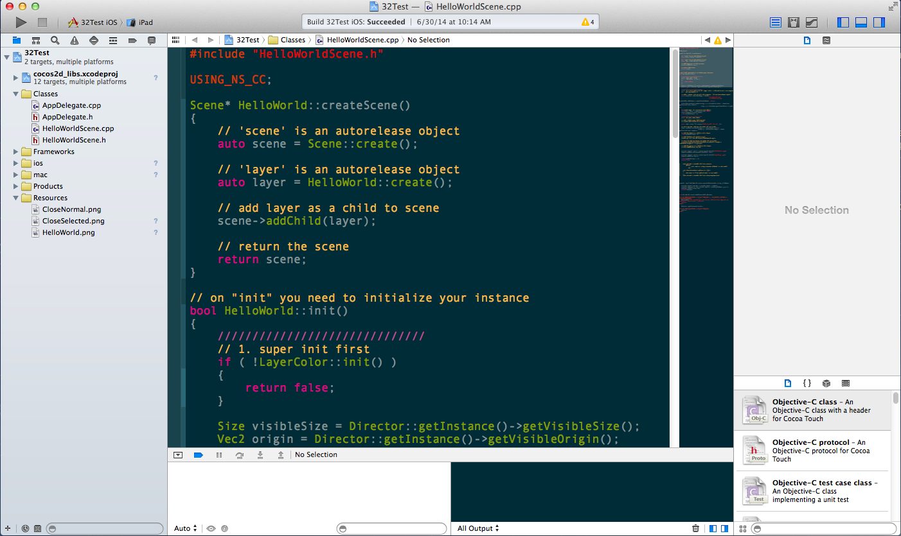

# Chapter 2: Jumping into Cocos2d-x

## Installation

[Appendix A - Android with Terminal Installation and Setup]()

[Appendix B - Android with Eclipse Installation and Setup]()

[Appendix C - iOS Installation and Setup]()

[Appendix D - Mac OSX Installation and Setup]()

[Appendix E - Linux Installation and Setup]()

[Appendix F - Win32 Installation and Setup]()

[Appendix G - WP8 Installation and Setup]()

[Appendix H - Creating a New Example Project]()

## Getting Started
This introduction requires a working Cocos2d-x setup to complete. Please ensure that you have gone through the appropriate installation steps for your platform. Please review the Appendix for `Installation Guides`. 

Follow Appendix H for 'Creating A New Example Project'.

Navigate to your new project and open it. This is dependepent upon the platform that you are running on. Please refer to the appropriate Appendix for your installation.

Let's Begin!

## What is in the Project
Everything you need to get started! Platform specific source files, Cocos2d-x and the Resources used in the 'Hello World' sample.


    
## Creating Your First Scene
'Hello World' has a default Scene, but lets ignore it and create our own.

`File -> New -> File` or `Command-N` and lets create a C++ class.


Select `Next` and let's call our new Scene `MainScene.cpp`.


Select `Create`.

Select the `MainScene.h` and paste in the following code:

```cpp
#ifndef __MAINSCENE_H__
#define __MAINSCENE_H__

#include "cocos2d.h"

#include <iostream>

class MainScene : public cocos2d::Scene
{
    public:
        MainScene();
        ~MainScene();
    
        static cocos2d::Scene* createScene();
    
    private:
    
};

#endif // __MAINSCENE_H__
```
Select the `MainScene.cpp` and paste in the following code:
```cpp
//
//  MainScene.cpp
//

#include "MainScene.h"

MainScene::MainScene() {}

MainScene::~MainScene() {}

cocos2d::Scene* MainScene::createScene()
{
    cocos2d::Scene* scene = cocos2d::Scene::create();
    
    
    return scene;
}
```
And finally, in `AppDelegate.cpp`, replace:

```cpp
auto scene = HelloWorld::createScene();
```
with:
```cpp
cocos2d::Scene* scene = MainScene::createScene();
```

That's it! But the Scene is empty. Lets add some content. 

## Adding Content to the Scene



    
## Using Actions to Animate Scenes
    
## Transitioning Between Scenes
    
## Building Complex Content Using Nodes
    
## Creating Nodes That Interact with Each Other