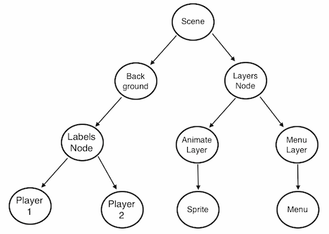
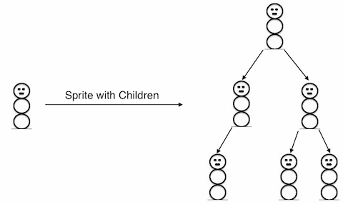
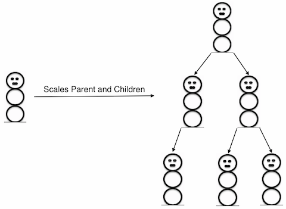

# Chapter 2: Basic Cocos2d-x Concepts

If you are reading this chapter, you probably know a bit about Cocos2d-x but really want to know more about how to use Cocos2d-x to make the game you are dreaming about. No problem, lets get started.

Cocos2d-x is a game engine and even further a game engine based upon OpenGL. What is a game engine? Dont get scared just yet! A game engine is a piece of software that provides common functionality that all games might have. You might hear this definition refered to an API or a framework. For this guide we are going to just use the term game engine. 

Game engines include many components that when used together will help speed up performance and development time. A game engine usually has some components, such as: a renderer, 2d/3d graphics, collision detection, a physics engine, sound, controller support, animations and more. Game engines usually support multiple platforms thus making it easy to develop your game and then deploy it to multiple platforms with little work required.

Since Cocos2d-x is a game engine, it provides a simplified API for developing cross platform mobile and desktop games. By encapsulating the power inside an easy to use API, you can focus on developing your games and worry less about the implementation of the technical underpinnings. Cocos2d-x will take care as much or as little of the heavy lifting as you want.

Cocos2d-x provides `Scenes`, `Scene Transitions`, `Sprite` creation, `Menus`, `3D`, `Audio` and much more. Everything you need to create your games is included.

## Main Components
It might seem overwhelming at first, but getting started with Cocos2d-x is simple. Before we dive into depth we must understand some of the concepts Cocos2d-x imploys. At the heart of Cocos2d-x are `Scenes`, `Nodes`, `Sprites`, `Menus` and `Actions`. Look at any of your favorite games and you will see all of these components!

Let's have a look. This looks like a very popular game you might have played:


Can you see any of these components? Let's make sure:


Maybe you have a few sketches of your game? Take a look at them, and try break them down into these pieces like the example above. 

## Director
Cocos2d-x uses the concept of a `Director`. Yes, just like in a movie! The `Director` makes decisions and tells the necessary recipient what to do. One common `Director` task is to control `Scene` replacements and transitions. The `Director` is a shared singleton object that you can call from anywhere in your code. It also takes care of the OpenGL initialization process.

Here is an example of a typical game flow. The `Director` takes care of transitioning through this as your game criteria decides:


You are the director of your game. You decide what happens, when and how. Take charge! 

## Scene
In your game you probably want a main menu, a few levels and an ending display. How do you organize all of these into the separate pieces they are? You guessed it, `Scene`. When you think about your favorite movie you can see that its distinctly broken down into scenes or separate parts of the story line. If we apply this same thought process to games, we should come up with at least a few scenes no matter how simple the game is.

Taking another look at the image from above:


This is a main menu and it is a single `Scene`. Yes, this scene is made up of several pieces that all fit together to give us the end result. Scenes are drawn by the renderer. To better understand this we need to talk a bit about a `Scene Graph`. No, its not something you will find in a math textbook.

## Scene Graph
A `Scene Graph` is a data structure that arranges a graphical scene. A `Scene Graph` contains `Nodes` in a tree structure.


It sounds and looks complicated. I'm sure you are asking why should you care about this technical detail if Cocos2d-x does the heavy lifting for you? It really is important to understand how Scenes are drawn by the renderer. Once you start adding nodes, sprites and animations to your game, you want to make sure you are getting the visual result you are looking for. What if you are not? What if your sprites are in the background and you want them the foremost objects? Take a step back and run through the scene graph on a piece of paper and I bet you find your mistake easily.

Since the `Scene Graph` is a tree; you can walk the tree. Cocos2d'x uses the `in-order walk` algorithm. An `in-order walk` is the left side of the tree being walked, then the root node, then the right side of the tree. Since the right side of the tree is rendered last, it is displayed first on the `Scene Graph`.


The `Scene Graph` is easily demonstrated, lets take a look at one of the figures above broken down:


Would be rendered as a tree, simplified to the following:



Although we haven't discussed the concept of `Layers` yet, lets build on the above and go one step further. Lets break the scene above down to see the `Layers` involved in making it up:


The `Scene` on the left is actually made up of multiple `Layers` that are given a different `z-order` to make them "stack" on top of each other. `Layers` are simply `Nodes`.

## Sprites
You probably know what sprites are, but lets be sure. All games have them. Sprites are the objects that you move around the screen. You can manipulate them. The main character in your game is probably a Sprite. I know what you might be thinking. Isn't every graphical object  a Sprite? No! Why? Well a Sprite is only a Sprite if you move it around. If you dont move it around it is just a `Node`.

Taking another look at the image from above, lets point out what are Sprites and what are Nodes:


Sprites are key in every game. Writing a platformer, you probably have a main character that is made by using an image of some sort. This is a `Sprite`. It is important to realize that a `Sprite` is NOT the same thing as a `Texture`. You can think of a `Texture` as a graphical representation but not something that you move around or manipulate like a `Sprite.` A `Sprite` can be made up of one or more `Textures`.

`Sprites` are easy to create and they have manipulatable properties.

```cpp
auto mySprite = Sprite::create("mysprite.png");

mySprite->setPosition(Vec2(300, 400));

mySprite->setRotation(40);

mySprite->setScale(1.5); // sets scale X and Y uniformly
```
Lets illustrate each property:


## Actions
Another integral part of Cocos2d-x is `Actions`. `Actions` allow the transformation of `Nodes` in time space. Want to move a `Sprite` from one `Point` to another and use a callback when complete? No problem! You can even create a `Sequence` of `Actions` to be performed on a `Node`. You can change `Node` properties like position, rotation and scale. Example Actions: `MoveBy`, `Rotate`, `Scale`. All games use `Actions`.

Taking another look, here are `Actions` in work:


Actions are easy to create:
```cpp
auto myNode = Node::create();

// Move a sprite 50 pixels to the right, and 10 pixels to the top over 2 seconds.
auto moveBy = MoveBy::create(2, Point(50,10));
myNode->runAction(moveBy);

// Move a sprite to a specific location over 2 seconds.
auto moveTo = MoveTo::create(2, Point(50,10));
myNode->runAction(moveTo);
```

## Sequences
Just like it sounds, a `Sequence` is multiple `Actions` run in a specified order. Need to run the `Sequence` in reverse? No problem, Cocos2d-x handles this with no additional work.

An example `Sequence` for moving a `Sprite` gradually:


This `Sequence` is easy to make:

```cpp
auto myNode = Node::create()

auto moveTo1 = MoveTo::create(2, Point(50,10));
auto moveBy1 = MoveTo::create(2, Point(100,10));
auto moveTo2 = MoveTo::create(2, Point(150,10));
auto delay = DelayTime::create(1);

myNode->runAction(Sequence::create(moveTo1, delay, moveBy1, delay, moveTo2, NULL));
```
## Parent Child Relationship
Cocos2d-x uses a `Parent and Child` relationship. This means that properties and changes to the parent node are applied to its children. Consider a single `Sprite` and then a `Sprite` that has children:

 

With children, changing the `Scale` of the parent will also change the `Scale` to all children:


```cpp
auto myNode = Node::create();

// scaling by setting
myNode->setScale(1.5); // scales uniformly by 1.5
```

Just like with `Scale`, if you `Rotate` the parent the children will also get rotated:


```cpp
auto myNode = Node::create();

// rotating by setting
myNode->setRotation(50);
```

## Audio
Every game needs music and sounds. Cocos2d-x provides an easy to use `Audio` API.


## What Else Does Cocos2d-x Provide?
Cocos2d-x doesn't stop with what you have read so far. If you can dream up the game, using Cocos2d-x can help you implement your vision. Cocos2d-x also provides:

    Saving Game Data
    Custom OpenGL
    Physics

and much more!

