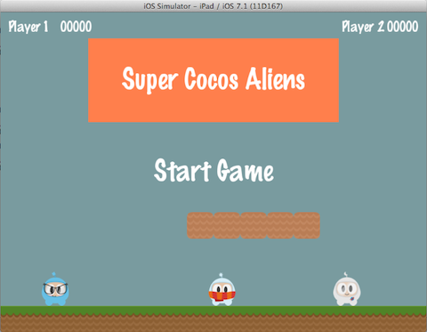
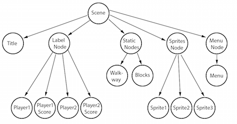
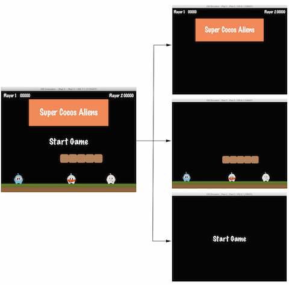
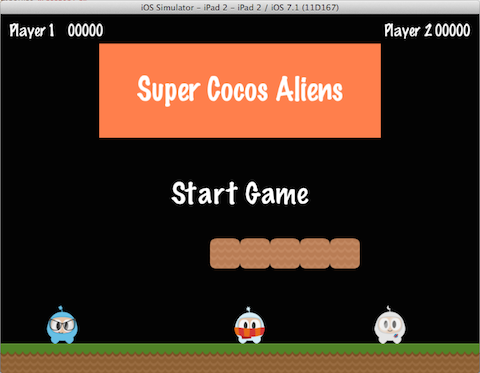
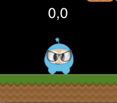
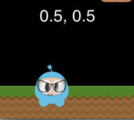
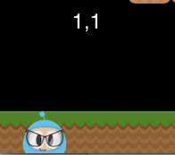
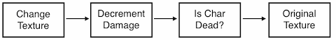

# Chapter 2: Basic Cocos2d-x Concepts

If you are reading this chapter you probably know a bit about Cocos2d-x, but
really want to know more about how to use Cocos2d-x to make the game you are
dreaming about.
No problem, let's get started.

Cocos2d-x is a cross-platform game engine. What is a game engine? Don't get 
scared just yet!
A game engine is a piece of software that provides common functionality that 
all games 
might have.You might hear this definition refered to as an API or framework. 
For this guide 
we are going to just use the term game engine.

Game engines include many components that when used together will help speed up 
performance 
and development time. A game engine usually has some components, such as: a 
renderer, 2d/3d graphics, collision detection, a physics engine, sound, controller 
support, animations and more.
Game engines usually support multiple platforms thus making it easy to develop 
your game and 
then deploy it to multiple platforms with little work required.

Since Cocos2d-x is a game engine, it provides a simplified API for developing 
cross platform mobile and desktop games.
By encapsulating the power inside an easy to use API, you can focus on developing 
your games and worry less about the implementation of the technical underpinnings.
Cocos2d-x will take care of as much or as little of the heavy lifting as you want.

Cocos2d-x provides `Scene`, `Transition`, `Sprite`, `Menu`, `Sprite3D`, `Audio` 
objects and much more. Everything you need to create your games is included.

## Main Components
It might seem overwhelming at first, but getting started with Cocos2d-x is simple. Before we dive into depth we must understand some of the concepts Cocos2d-x 
utilizes. At the heart of Cocos2d-x are `Scene`, `Node`, `Sprite`, `Menu` 
and `Action` objects. Look at any of your favorite games and you will see all 
of these components!

Let's have a look. This looks like a very popular game you might have played:



Can you see any of these components? Let's make sure:


Maybe you have a few sketches of your game? Take a look at them and see what 
components you have compared the example above.

## Director
Cocos2d-x uses the concept of a `Director`. Yes, just like in a movie! The 
`Director` makes decisions and tells the necessary recipient what to do. One 
common `Director` task is to control `Scene` replacements and transitions. The `Director` is a shared singleton object that you can call from anywhere in your 
code.

Here is an example of a typical game flow. The `Director` takes care of 
transitioning through this as your game criteria decides:


You are the director of your game. You decide what happens, when and how. 
Take charge!

## Scene
In your game you probably want a main menu, a few levels and an ending scene. 
How do you organize all of these into the separate pieces they are? You guessed 
it, `Scene`. When you think about your favorite movie you can see that its 
distinctly broken down into scenes, or separate parts of the story line. If we 
apply this same thought process to games, we should come up with at least a few 
scenes no matter how simple the game is.

Taking another look at the image from above:


This is a main menu and it is a single `Scene`. Yes, this scene is made up of 
several pieces that all fit together to give us the end result. Scenes are drawn 
by the `Renderer`. The `Renderer` is responsible for _rendering_ the sprites and 
other objects into the scree. To better understand this we need to talk a bit 
about the _Scene Graph_.

## Scene Graph
A _scene graph_ is a data structure that arranges a graphical scene. A 
_scene graph_ contains `Node` objects in a tree (yes, it is called 
_screne graph_, but it is actually represented by a _tree_) structure.


It sounds and looks complicated. I'm sure you are asking why should you care 
about this technical detail if Cocos2d-x does the heavy lifting for you? It 
really is important to understand how Scenes are drawn by the renderer.
Once you start adding nodes, sprites and animations to your game, you want 
to make sure you are getting the visual result you are looking for. What if 
you are not?
What if your sprites are in the background and you want them the foremost 
objects? Take a step back and run through the scene graph on a piece of paper 
and I bet you find your mistake easily.

Since the _Scene Graph_ is a tree; you can "walk the tree". Cocos2d-x uses 
the _in-order walk_ algorithm. An _in-order walk_ is the left side of the 
tree being walked, then the root node, then the right side of the tree. Since 
the right side of the tree is rendered last, it is displayed first on the 
_scene graph_.


The _scene graph_ is easily demonstrated, let's take a look at one of the 
figures above broken down:


Would be rendered as a tree, simplified to the following:



Another point to think about is elements with a  negative _z-order_ are 
on the left side of the tree while elements with a positive _z-order_ are 
on the right side of the tree.
Keep this in consideration when ordering your elements!

Building on this concept, we can think of a `Scene` as a collection of 
`Node` objects.
Let's break the scene above down to see the the _scene graph_ uses the 
_z-order_ to layout out the `Scene`:



The `Scene` on the left is actually made up of multiple `Node` objects 
that are given a different _z-order_ to make them "stack" on top of each other.

In Cocos2d-x, you build the _Scene Graph_ using the `addChild()` API:

```cpp
// Adds a child with the z-order of -2, that means
// it goes to the "left" side of the tree (because it is negative)
scene->addChild(title_node, -2);

// When you don't specify the z-order, it will use 0
scene->addChild(label_node);

// Adds a child with the z-order of 2, that means
// it goes to the "right" side of the tree (because it is positive)
scene->addChild(sprite_node, 1);
```

## Sprites
All games have _Sprites_, and you may or may not realize what they are. 
Sprites are the objects that you move around the screen.
You can manipulate them. The main character in your game is probably a 
Sprite. I know what you might be thinking -  isn't every graphical object 
a `Sprite`?
No! Why? Well a Sprite is only a Sprite if you move it around. If you 
dont move it around it is just a `Node`.

Taking another look at the image from above, let's point out what are 
Sprites and what are Nodes:



Sprites are key in every game. Writing a platformer, you probably have 
a main character that is made by using an image of some sort. This is 
a `Sprite`.

_Sprites_ are easy to create and they have manipulatable properties 
like: `position`, `rotation`, `scale`, `opacity`, `color`, and more.

```cpp
// This is how to create an sprite
auto mySprite = Sprite::create("mysprite.png");

// this is how to change the properties of the sprite
mySprite->setPosition(Vec2(500, 0));

mySprite->setRotation(40);

mySprite->setScale(2.0); // sets scale X and Y uniformly

mySprite->setAchorPoint(0, 0);
```
Let's illustrate each property, consider the following screenshot from 
the example code for this chapter:


If we set the position using `mySprite->setPosition(Vec2(500, 0));`:


Take a look at what happened. The `Sprite` postion has changed from its 
original position to the new position that we specified.

If we now set a new rotation using `mySprite->setRotation(40);`:


Take a look at what happened. The `Sprite` has been rotated to the new 
amount that we specified.

If we now specify a new scale using `mySprite->setScale(2.0);`:


Again, we can see that the `Sprite` now has changed according to our code 
changes.

Lastly, all `Node` objects (remember that a `Sprite` is a subclass of `Node`) 
have a value for _anchor point_. We haven't talked about this yet, so now 
is a good time. You can think of _anchor point_ as a way of specifying what 
part of the sprite will be used when setting the position of it.

Using the character from our example game and setting the anchor point to 
0, 0 using  `mySprite->setAchorPoint(0, 0);` would result in the lower left 
corner of our sprite being used as the basis for any `setPosition()` call. 
Let's see a few of these in action:

    

Take a look at the red dot in each picture. This red dot illustrates there 
the anchor point is!

As you can see _anchor point_ is very useful when positioning _Nodes_. You 
can even adjust the _anchor point_ dynamically to simulate effects in your 
game.

We can truly work with our sprites. What if we wanted to have these same 
types of changes occur in an automated, time determined manner? Well, keep 
reading...

## Actions
Creating a `Scene` and adding `Sprite` objects on the screen is only part 
of what we need to do. For a game to be a game we need to make things move 
around! `Action` are an integral part of every game. _Actions_ allow the 
transformation of `Node` objects in time space. Want to move a `Sprite` 
from one `Point` to another and use a callback when complete? No problem! 
You can even create a `Sequence` of `Action` items to be performed on a 
`Node`. You can change `Node` properties like position, rotation and scale. 
Example Actions: `MoveBy`, `Rotate`, `Scale`. All games use _Actions_.

Taking a look at the sample code for this chapter, here are _Actions_ in work:


and after 5 seconds the sprite will move to a new position:


_Actions_ are easy to create:
```cpp
auto mySprite = Sprite::create("Blue_Front1.png");

// Move a sprite 50 pixels to the right, and 10 pixels to the top over 2 seconds.
auto moveBy = MoveBy::create(2, Point(50,10));
mySprite->runAction(moveBy);

// Move a sprite to a specific location over 2 seconds.
auto moveTo = MoveTo::create(2, Point(50,10));
mySprite->runAction(moveTo);
```

## Sequences and Spawns
With moving _Sprites_ on the screen we have everything we need to create 
our game, right? Not quite. What about running multiple _Actions_? Yes, 
Cocos2d-x handles this too in a few different ways.

Just like it sounds, a `Sequence` is multiple _Actions_ run in a specified 
order. Need to run the `Sequence` in reverse? No problem, Cocos2d-x handles 
this with no additional work.

Take a look at the flow of an example `Sequence` for moving a `Sprite` gradually:



This `Sequence` is easy to make:
```cpp
auto mySprite = Node::create()

// move to point 50,10 over 2 seconds
auto moveTo1 = MoveTo::create(2, Point(50,10));

// move from current postion by 100,10 over 2 seconds
auto moveBy1 = MoveBy::create(2, Point(100,10));

// move to point 150,10 over 2 seconds 
auto moveTo2 = MoveTo::create(2, Point(150,10));

// create a delay
auto delay = DelayTime::create(1);

mySprite->runAction(Sequence::create(moveTo1, delay, moveBy1, delay->clone(), moveTo2, nullptr));
```

This example runs a `Sequence`, in order, but what about running all the 
specified _Actions_ at the same time? Cocos2d-x supports this too and it 
is called `Spawn`. `Spawn` will take all the specified _Actions_ and execute 
them at the same time. Some might be longer than others, so they won't all 
finish at the same time if this is the case.

```cpp
auto myNode = Node::create()

auto moveTo1 = MoveTo::create(2, Point(50,10));
auto moveBy1 = MoveTo::create(2, Point(100,10));
auto moveTo2 = MoveTo::create(2, Point(150,10));

myNode->runAction(Spawn::create(moveTo1, moveBy1, moveTo2, nullptr));
```

Why `Spawn` actions? Is there ever a reason? Sure! What if your main 
character has multiple _Actions_ when obtaining a power up? Maybe beating 
the boss at the end of a level has multiple _Actions_ that need to happen 
to end the level.

## Parent Child Relationship
Cocos2d-x uses a `Parent and Child` relationship. This means that properties 
and changes to the parent node are applied to its children. Consider a single 
`Sprite` and then a `Sprite` that has children:


With children, changing the rotation of the parent will also change the 
rotation to all children:


```cpp
auto myNode = Node::create();

// rotating by setting
myNode->setRotation(50);
```

Just like with rotation, if you the scale of the parent the children 
will also get scaled:


```cpp
auto myNode = Node::create();

// scaling by setting
myNode->setScale(2.0); // scales uniformly by 2.0
```

## Conclusion
We have gone through a lot of Cocos2d-x concepts. Take a deep breath. 
Dont worry. Just dive in with your ideas and take it one step at a time.
Cocos2d-x and programming in general are not a skill that is learned 
overnight. These take practice and understanding.
Remember that the [forums](http://discuss.cocos2d-x.org) are also there to help you 
with questions.
