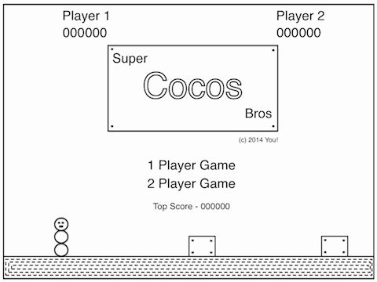
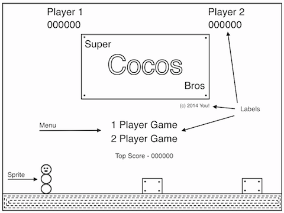
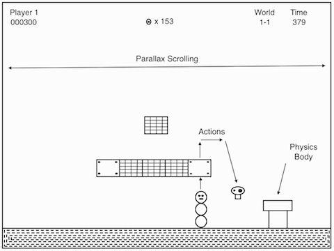
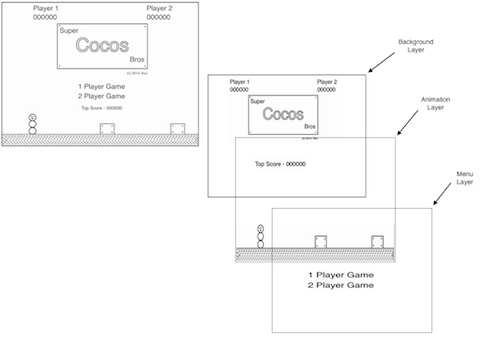
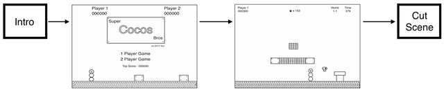
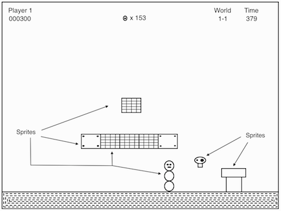
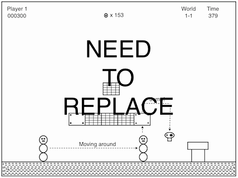
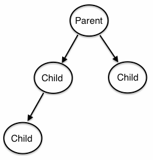
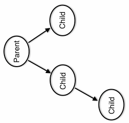

# Chapter 2: Basic Cocos2d-x Concepts

Cocos2d-x is a game engine based upon OpenGL. It provides a simplified API for developing cross platform mobile and desktop games. By encapsulating the power inside and easy to use API, you can focus on developing your games and worry less about the implementation of the technical underpinnings.

Cocos2d-x provides `Scenes` and `Scene Transitions`, `Sprite` creation, `Menus`, `3D`, `Audio` and so much more. Everything you need to create your games is included.

## Main Components
At the heart of Cocos2d-x are `Scenes`, `Nodes`, `Sprites`, `Menus` and `Actions`. Look at any of your favorite games and you will see all of these components!

Have you played this very popular game?



Can you see any of these components? Let's make sure:



This is only an intro scene, lets have a look at actual game play:



As you can see it takes a lot of pieces that need to fit and work together. 

## Scene Graph
A `Scene Graph` is a data structure that arranges a graphical scene. A `Scene Graph` contains `Nodes` in a tree structure.


Since the `Scene Graph` is a tree; you can walk the tree. Cocos2d'x uses the `in-order walk` algorithm. An `in-order walk` is the left side of the tree being walked, then the root node, then the right side of the tree. Since the right side of the tree is rendered last it is displayed first on the `Scene Graph`


The `Scene Graph` is easily demonstrated, lets take a look at one of the figures above broken down:



The `Scene` on the left is actually made up of multiple `Layers` that are given a different `z-order` to make them "stack" on top of each other. `Layers` are simply `Nodes`.

## Director
Cocos2d-x uses the concept of a `Director`. Yes, just like in a movie! The `Director` makes decisions and tells the necessary recipient what to do. One common `Director` task is to control `Scene` replacements and transitions. The `Director` is a shared singleton object that you can call from anywhere in your code. It also takes care of the OpenGL initialization process.

Here is an example of a typical game flow. The `Director` takes care of transitioning through this as your game criteria decides:



## Sprites
Sprites are key in every game. Writing a platformer, you probably have a main character that is made by using an image of some sort. This is a `Sprite`. Taking another look at an image from above:



These are all `Sprites`. 

## Actions
Another integral part of Cocos2d-x is `Actions`. `Actions` allow the transformation of `Nodes` in time space. Want to move a `Sprite` from one `Point` to another and use a callback when complete? No problem! You can even create a `Sequence` of `Actions` to be performed on a `Node`. You can change `Node` properties like position, rotation and scale. Example Actions: `MoveBy`, `Rotate`, `Scale`. All games use `Actions`

Taking another look, here are `Actions` in work.



## Parent Child Relationship
Cocos2d-x uses a `Parent and Child` relationship. This means that properties and changes to the parent node are applied to its children. Example: If you rotate a parent node, the children also rotate. 



If you wanted to `Rotate` the parent you could do this by using an `Action` in time or simply just rotate it.

```cpp
auto myNode = cocos2d::Node::create();

// rotating by setting
myNode->setRotation(10);

// using RotateTo Action - Rotate Node TO specified amount
auto rotateTo = cocos2d::RotateTo::create(2.0f, 10);
myNode->runAction(rotateTo);

// using RotateBy Action - Rotate Node BY specified amount
auto rotateBy = cocos2d::RotateBy::create(2.0f, 10);
myNode->runAction(rotateBy);
```
In either case rotating the parent and the same rotation wuld be applied to the children.



## What Else Does Cocos2d-x Provide?

Cocos2d-x doesn't stop with what you have read so far. If you can dream up the game, using Cocos2d-x can help you implement your vision. Cocos2d-x also provides:

    Audio
    Saving Game Data
    Custom OpenGL
    Sequences
    Physics

and much more!

