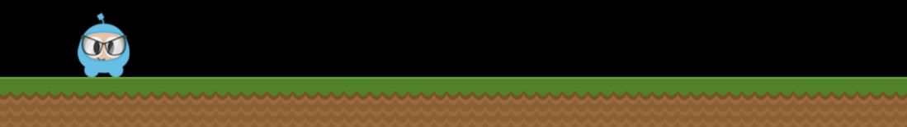
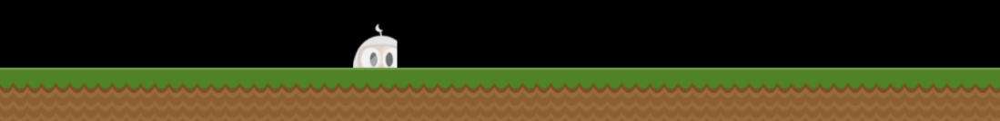
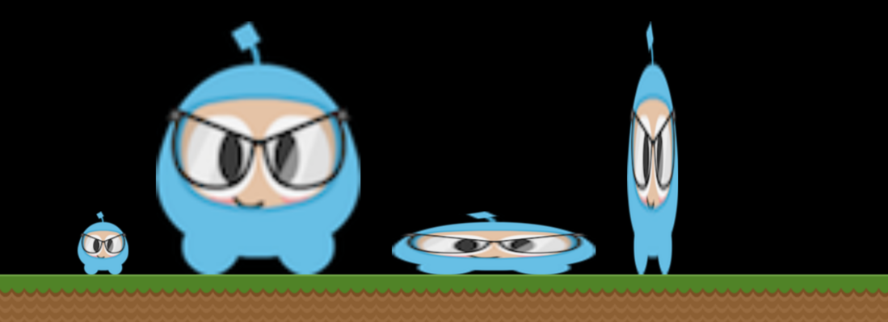

# Chapter 3: Sprites

## What are Sprites
A Sprite is a 2D image that can be animated or transformed by changing its
properties, including `rotation`, `position`, `scale`, `color`, etc.

## Creating Sprites
There are different ways to create Sprites depending upon what you need to
accomplish. You can create a `Sprite` from a number of graphic formats including:
PNG, JPEG, TIFF, and others. Let's go through some create methods and talk about
each one.

### Creating a Sprite
A `Sprite` can be created by specifying an image file to use.
```cpp
auto mySprite = Sprite::create("mysprite.png");
```



This creates a `Sprite` using the 'mysprite.png' image. The result is that the
created `Sprite` uses the whole image. `Sprite` has the same dimensions
of `mysprite.png`. If the image file is 200 x 200 the resulting `Sprite` is 200 x 200.

### Creating a Sprite with a Rect

In the previous example, the created `Sprite` has the same size as the original PNG.
If you want to create a `Sprite` with only a certain portion of the image file,
you can do it by specifying a `Rect`.

`Rect` has 4 values: origin x, origin y, width and height.

```cpp
auto mySprite = Sprite::create("mysprite.png", Rect(0,0,40,40));
```



`Rect` starts at the top left corner. This is the opposite of what you might be
used to when laying out screen position as this starts in the lower left corner.
Thus the resulting `Sprite` is only a portion of the PNG. In this case the `Sprite`
is 40 x 40 starting at the top left corner.

If you dont specify a `Rect` cocos2d-x does this automatically for the full width
and height of the image file you specify. To cement another example, if we use a
PNG that is 200 x 200 the following 2 statements would have the same result.
```cpp
auto mySprite = Sprite::create("mysprite.png");

auto mySprite = Sprite::create("mysprite.png", Rect(0,0,200,200));
```

## Creating a Sprite from a Sprite Sheet
A _sprite sheet_ is a way to combine sprites into a single file. This reduces the
overall file size compared to having individual files for each `Sprite`. This means
you will significantly reduce memory usage, file size and loading time.

Also, using sprite sheets is a needed condition in order to achieve better performance
by _batching_ the _draw calls_. More on this in the Advanced Chapter.

When using a _sprite sheet_, it is first loaded, in its entirety, into the
`SpriteFrameCache`. `SpriteFrameCache` is a caching class that retains `SpriteFrame`
for future quicker access.

And a `SpriteFrame` is a object that contains the image file name and a `Rect` that
specifies the size of the sprite.

The `SpriteFrameCache` prevents needing to load a `SpriteFrame` multiple times,
over and over. The `SpriteFrame` is loaded once and retained in the `SpriteFrameCache`

Here is an example sprite sheet:


It doesn't look like much but let's take a closer look at what is happening:


As you can see the _sprite sheet_, at a minimum reduces unneeded space, consolidates
all sprites into a single file.

Let's tie this all together!

### Loading a Sprite Sheet
Load your _sprite sheet_ into the `SpriteFrameCache`, probably in `AppDelegate`:
```cpp
// load the Sprite Sheet
auto spritecache = SpriteFrameCache::getInstance();

// the .pist file can be generated with any of the tools mentioned below
spritecache->addSpriteFramesWithFile("sprites.plist");
```
Now that we have a _sprite sheet_ loaded into `SpriteFrameCache` we can create `Sprite`
objects by utilizing it.

### Creating a Sprite from SpriteFrameCache
This creates a `Sprite` by pulling it from the `SpriteFrameCache`.
```cpp
auto mysprite = Sprite::createWithSpriteFrameName("mysprite.png");
```


### Creating a Sprite from a SpriteFrame
Another way to create the same `Sprite` is by fetching the `SpriteFrame` from the
`SpriteFrameCache`, and then creating the `Sprite` with the `SpriteFrame`.
Example:

```cpp
// this is equivalent to the previous example,
// but it is created by retrieving the spriteframe from the cache.
auto newspriteFrame = SpriteFrameCache::getInstance()->getSpriteFrameByName("mysprite.png");
auto newSprite = Sprite::createWithSpriteFrame(newspriteFrame);
```


### Tools for creating Sprite Sheets
A _sprite sheet_ is a a manual, tedious process if doing so by hand. Fortunately
there are tools that can generate them automatically. These tools also can provide
many more adjustments you can make to optimize your _sprite sheet_ even further.
Here are a few tools:

[Cocos Studio](http://www.cocos2d-x.org/wiki/CocoStudio)

[Texture Packer](https://www.codeandweb.com/texturepacker)

[Zwoptex](https://www.zwopple.com/zwoptex/)

## Sprite Manipulation
After creating a `Sprite`, there are a variety of properties it has that can be
manipulated.

Given:
```cpp
auto mySprite = Sprite::create("mysprite.png");
```


### Anchor Point and Position
_Anchor Point_ is a point that you set as a way of specifying what part of
the `Sprite` will be used when setting the position of it. _Anchor Point_ effects
only properties that can be transformed. This includes _scale_, _rotation_, _skew_.
This excludes _color_ and _opacity_. _Anchor Point_ uses a bottom left coordinate
system. This means that when specifying X and Y coordinate values you need to make
sure to start at the bottom lefthand corner to do your calculations. By default
the _anchor point_ of all `Node` objects is (0.5, 0.5).

Setting _anchor point_ is easy:
```cpp
// DEFAULT anchor point for all Nodes
mySprite->setAnchorPoint(0.5, 0.5);

// bottom left
mySprite->setAnchorPoint(0, 0);

// top left
mySprite->setAnchorPoint(0, 1);

// bottom right
mySprite->setAnchorPoint(1,0);

// top right
mySprite->setAnchorPoint(1, 1);
```
To represent this visually:


### Sprite properties effected by anchor point
_Anchor Point_ effects only properties that can be transformed. This includes
_scale_, _rotation_, _skew_.

#### Position
A _sprites_ position is effected by _achnor point_ as it is this point that is
used as a starting point for positioning. Let's visually look at how this happens.
Notice the colored line and where the _sprites_ position is in relation to it.
Notice as we change the _anchor point_ values the _sprites_ postion changes.
It is important to note that all it took was changing the _anchor point_. We did
not use a `setPosition()` statement to achieve this:


There are more ways to set position than just _anchor point_. `Sprite` objects
can also be set using specific `setPosition()` statements.
```cpp
// position a sprite to a specific position of x = 100, y = 200.
mySprite->setPosition(Vec2(100, 200);
```

#### Rotation
Changes the _sprites_ rotation, by a positive or negative value.
```cpp
// rotates sprite by +20
mySprite->setRotation(20.0f);

// rotates sprite by -20
mySprite->setRotation(-20.0f);

// rotates sprite by +60
mySprite->setRotation(60.0f);

// rotates sprite by -60
mySprite->setRotation(-60.0f);
```


#### Scale
Changes the *sprites* scale, either by x, y or uniformly for both x and y.

```cpp
// increases X and Y size by 2.0 uniformly
mySprite->setScale(2.0);

// increases just X scale by 2.0
mySprite->setScaleX(2.0);

// increases just Y scale by 2.0
mySprite->setScaleY(2.0);
```


#### Skew
Changes the *sprites* skew, either by x, y or uniformly for both x and y.
```cpp
// adjusts the X skew by 20.0
mySprite->setSkewX(20.0f);

// adjusts the Y skew by 20.0
mySprite->setSkewY(20.0f);
```


### Sprite properties not effected by anchor point
There are a few properties of `Sprite` objects that are not affected by
_anchor point_. Why? Because they only change superficial qualities like *color*
and *opacity*.

#### Color
Changes the *sprites* color. This is done by passing in a `Color3B` object.
`Color3B` objects are RGB values.
```cpp
// set the color by passing in a Color3B object.
mySprite->setColor(Color3B(155, 200, 50));
```


#### Opacity
Changes the *sprites* opacity by the specified value.
```cpp
// set the opacity by passing in a value
mySprite->serOpacity(30);
```

