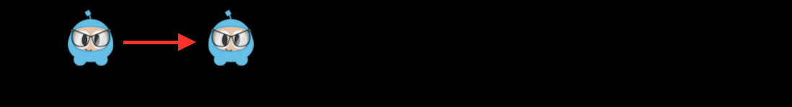
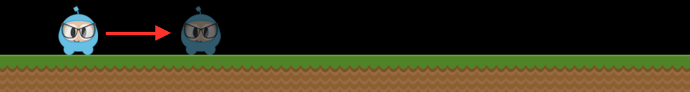
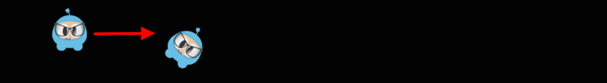
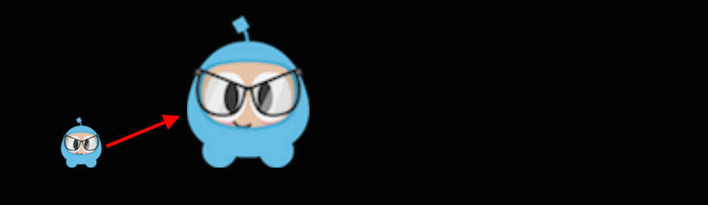
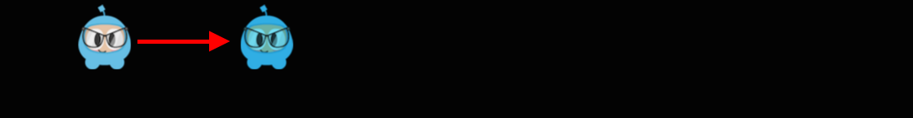
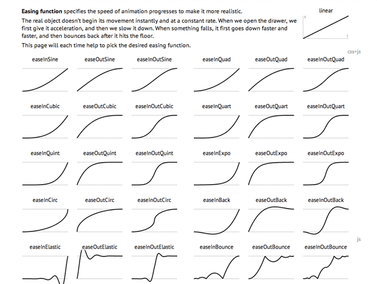
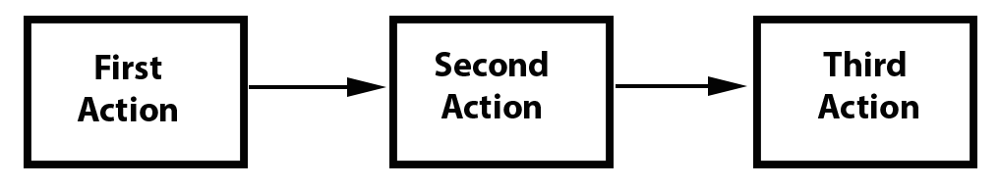
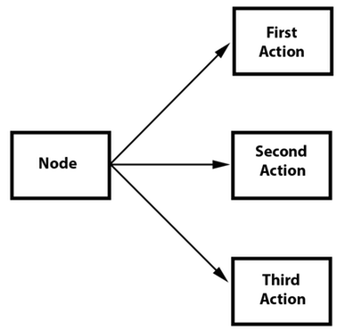

# Chapter 4: Actions
`Action` objects are just like they sound,  make a `Node` perform a change to its 
properties. `Action` objects allow the transform of `Node` properties in time. Any 
object with a base class of `Node` can have `Action` objects performed on it. As an 
example, you can move a `Sprite` from one position to another and do it over a time 
span.

Example, this is how the `MoveTo` action can be used:
```cpp
auto mySprite = Sprite::create("mysprite.png");

// Move sprite to a specific location over 2 seconds.
auto moveTo = MoveTo::create(2, Point(50, 10));

mySprite->runAction(moveTo);
```

## Basic Actions and how to run them
Basic actions are usually a singular action, thus accomplishing a single objective.

### By and To, what is the difference?
You will notice that each `Action` has a `By` and `To` version. Why? They are different 
in what they accomplish. A `By` action takes into account the current state of the `Node` 
and the action performs incrementially based upon the `Node` objects current properties. 
A `To` action is fixed and the `Node` is changed to specified, fixed, `Action`.

Let's take a look at a few examples:

### Move
Move the `Node` position over a set period of time.
```cpp
auto mySprite = Sprite::create("mysprite.png");

// Move a sprite to a specific location over 2 seconds.
auto moveTo = MoveTo::create(2, Point(50, 0));

mySprite->runAction(moveTo);

// Move a sprite 50 pixels to the right, and 0 pixels to the top over 2 seconds.
auto moveBy = MoveBy::create(2, Point(100, 0));

mySprite->runAction(moveBy);
```


### Fade In/Out
Fades In a `Node` that implements the RGBA protocol.

It modifies the opacity from 0 to 255. The "reverse" of this action is `FadeOut`
```cpp
auto mySprite = Sprite::create("mysprite.png");

// appy a fade to 200
auto fadeIn = FadeIn::create(200.0);
mySprite->runAction(fadeIn);

// fade to 120 over 2 seconds
auto fadeTo = FadeTo::create(2.0f, 120.0f);
mySprite->runAction(fadeTo);
```

### Animate
```cpp

```
### Rotate
Rotates a `Node` clockwise over 2 seconds.
```cpp
auto mySprite = Sprite::create("mysprite.png");

// Rotates a Node to the specific angle over 2 seconds
auto rotateTo = RotateTo::create(2.0f, 40.0f);
mySprite->runAction(rotateTo);

// Rotates a Node clockwise by 40 degree over 2 seconds
auto rotateBy = RotateBy::create(2.0f, 40.0f);
mySprite->runAction(rotateBy);
```


### Scale
Scales a `Node` by 10 over 2 seconds.
```cpp
auto mySprite = Sprite::create("mysprite.png");

// Scale uniformly by 3x over 2 seconds
auto scaleBy = ScaleBy::create(2.0f, 3.0f);
mySprite->runAction(scaleBy);

// Scale X by 5 and Y by 3x over 2 seconds
auto scaleBy = ScaleBy::create(2.0f, 3.0f, 3.0f);
mySprite->runAction(scaleBy);

// Scale to uniformly to 3x over 2 seconds
auto scaleTo = ScaleTo::create(2.0f, 3.0f);
mySprite->runAction(scaleTo);

// Scale X to 5 and Y to 3x over 2 seconds
auto scaleTo = ScaleTo::create(2.0f, 3.0f, 3.0f);
mySprite->runAction(scaleTo);
```


### Tint
Tints a Node that implements the NodeRGB protocol from current tint to a custom one.
```cpp
auto mySprite = Sprite::create("mysprite.png");

// Tints a node to the specified RGB values
auto tintTo = TintTo::create(2.0f, 120.0f, 232.0f, 254.0f);
mySprite->runAction(tintTo);

// Tints a node BY the delta of the specified RGB values.
auto tintBy = TintBy::create(2.0f, 120.0f, 232.0f, 254.0f);
mySprite->runAction(tintBy);
```


### Easing
Easing is animating with a specified speed to make the animations smooth. A few things 
to keep in mind is that regardless of spped, ease actions always start and finish at 
the same time.

Easing functions displayed over a graph.


Cocos2d-x supports most of the easing function in the above graph. They are also simple 
to implement.
```cpp
auto mySprite1 = Sprite::create("mysprite1.png");
auto mySprite2 = Sprite::create("mysprite2.png");

auto move = MoveBy::create(2, Point(700, 64));
auto move_back = move->reverse();
        
auto move_ease_in = EaseBounceIn::create(move->clone() );
auto move_ease_in_back = move_ease_in->reverse();
        
auto move_ease_out = EaseBounceOut::create(move->clone() );
auto move_ease_out_back = move_ease_out->reverse();
        
auto delay = DelayTime::create(0.25f);
        
auto seq1 = Sequence::create(move, delay, move_back, delay->clone(), nullptr);
auto seq2 = Sequence::create(move_ease_in, delay->clone(), move_ease_in_back, 
delay->clone(), nullptr);
        
mySprite1->runAction( RepeatForever::create(seq1));
mySprite2->runAction( RepeatForever::create(seq2));
```


## Sequences and how to run them
Sequences are a series of `Action` objects to be executed sequentially. This can be 
any number of `Action` objects and even another `Sequence`.



### An example sequence
```cpp
auto mySprite = Sprite::create("mysprite.png");

// create a few actions.
auto jump = JumpBy::create(0.5, Point(0, 0), 100, 1);

auto rotate = RotateTo::create(2.0f, 10);

// create a few callbacks
auto callbackJump = CallFunc::create([](){
    log("Jumped!");
});

auto callbackRotate = CallFunc::create([](){
    log("Rotated!");
});

// create a sequence with the actions and callbacks
auto seq = Sequence::create(jump, callbackJump, rotate, callbackRotate, nullptr);

// run it
mySprite->runAction(seq);
```
So what is this `Sequence` action do?

It will executes the following actions sequentially:

`Jump` -> `callbackJump` -> `Rotate` -> `callbackRotate`


### Spawn
Spawn is very similar to `Sequence`, except that all actions will run at the same time. 
You can have any number of `Action` objects and even other `Spawn` objects!



`Spawn` produces the same result as running multiple consecutive `runAction()` statements. However, the benefit of spawn is that you can put it in a `Sequence` to help acieve specific effects that you cannot otherwise. Combining `Spawn` and `Sequence` is a very powerful feature

Example:
```cpp
// create 2 actions and run a Spawn on a Sprite
auto mySprite = Sprite::create("mysprite.png");

auto moveBy = MoveBy::create(10, Point(400,100));
auto fadeTo = FadeTo::create(2.0f, 120.0f);

// running the above Actions with Spawn.
auto mySpawn = Spawn::createWithTwoActions(moveBy, fadeTo);
mySprite->runAction(mySpawn);

// running the above Actions with consecutive runAction() statements.
mySprite->runAction(moveBy);
mySprite->runAction(fadeTo);
```
Both would produce the same result. However, one can use `Spawn` in a `Sequence`:
```cpp
// create a Sprite
auto mySprite = Sprite::create("mysprite.png");

// create a few Actions
auto moveBy = MoveBy::create(10, Point(400,100));
auto fadeTo = FadeTo::create(2.0f, 120.0f);
auto scaleBy = ScaleBy::create(2.0f, 3.0f);

// create a Spawn to use
auto mySpawn = Spawn::createWithTwoActions(scaleBy, fadeTo);

// tie everything together in a sequence
auto seq = Sequence::create(moveBy, mySpawn, moveBy, nullptr);

// run it
mySprite->runAction(seq);
```

### Reverse
Reverse is exactly like it sounds. If you run a series of actions, you can call 
`reverse()` to run it in the opposite order. Backwards. However it is not just simply running in reverse. It is actually manipuating the properties of the original `Sequence` or `Spawn` in reverse too. 

Using the `Spawn` example above reversing is simple.
 ```cpp
mySprite->runAction(mySpawn->reverse());
```
Most `Action` and `Sequence` objects are reversible!
