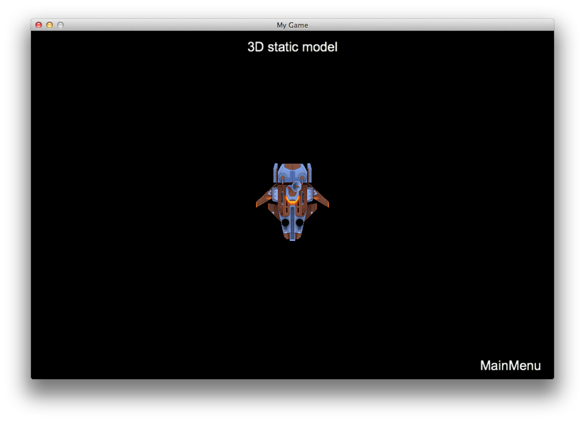
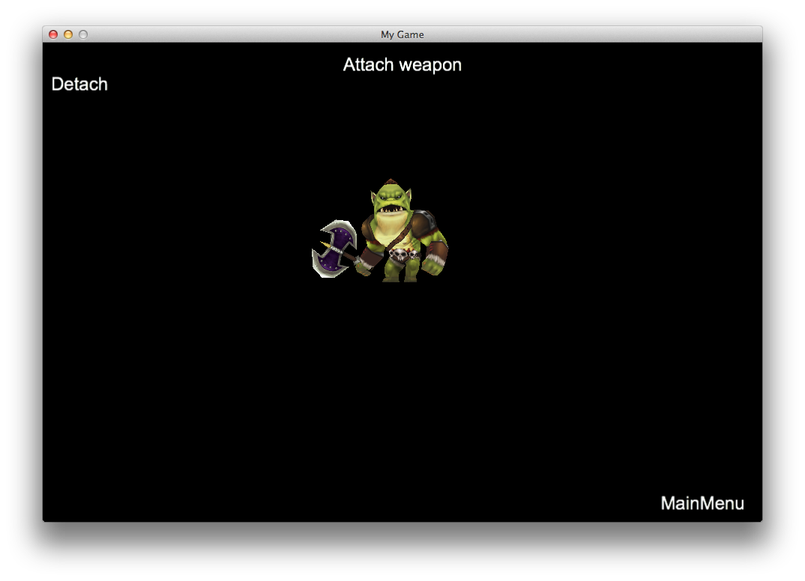
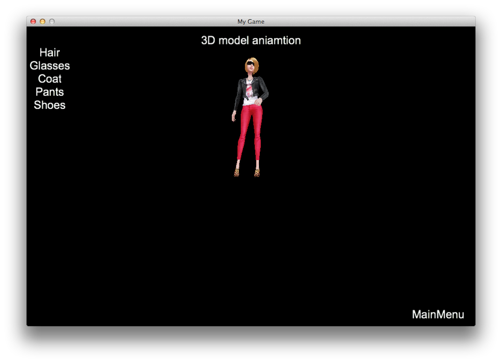
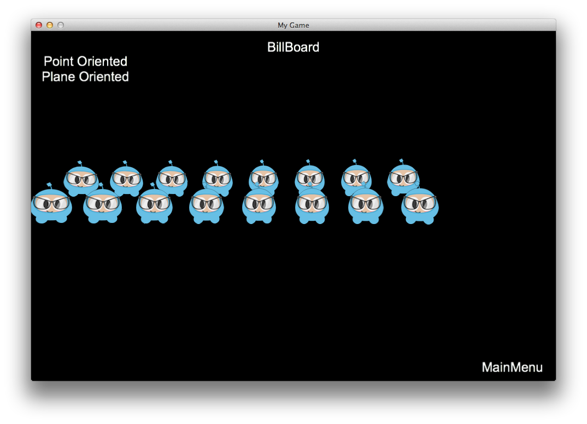
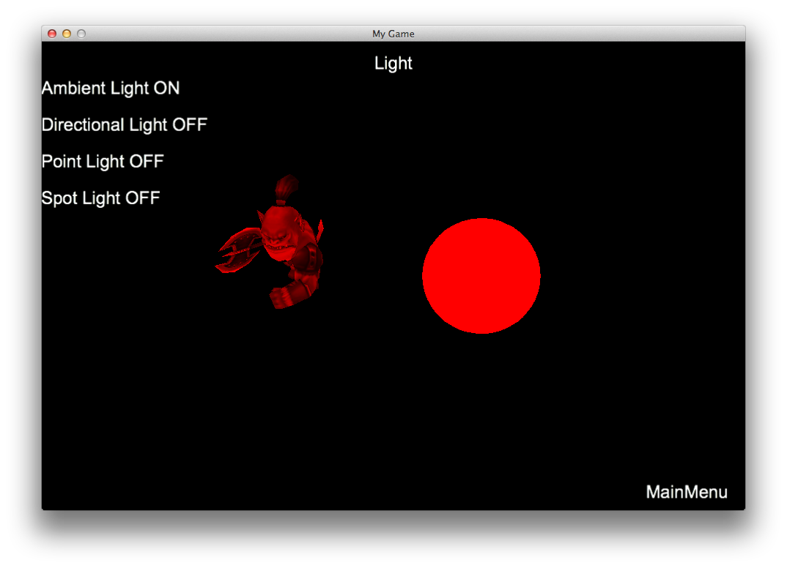
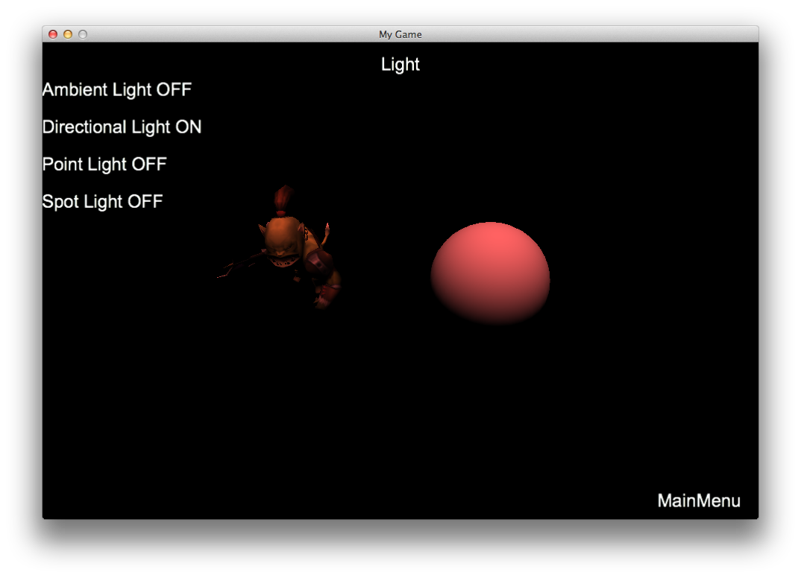
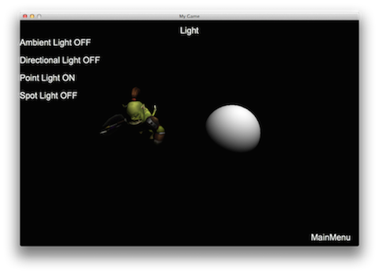
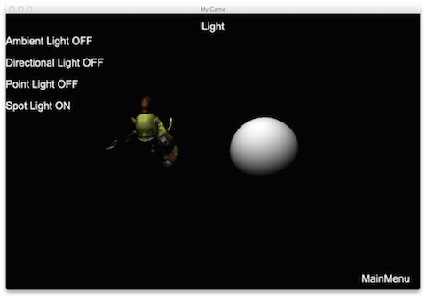

# Chapter 9: 3D

## Sprite3D
`Sprite3D` works in many ways like a normal `Sprite`. `Sprite3D` is a
three-dimensional object that includes the _model_, _skeletal_ and _rendering_
data needed to create the 3D _sprite_. `Sprite3D` is derived from `Node` and
therefore inherits all of `Node` functionality. `Sprite3D` can be created with
Wavefront objects, or with our own object file format: `.c3b` (for binary files)
or `.c3t` (for text files). Since `Sprite3D` is a subclass of `Node`, it also
supports `Action` objects. It is easy to load and display a `Sprite3D` object:
```cpp
cocos2d::Rect visibleRect = Director::getInstance()->getOpenGLView()->getVisibleRect();
auto sprite = Sprite3D::create("boss.c3b");
sprite->setScale(5.f);
sprite->setPosition(Vec2(visibleRect.origin.x+visibleRect.size.width/2,
								visibleRect.origin.y+visibleRect.size.height/2));
scene->addChild(sprite);
```
This creates a `Sprite3D` object based upon the passed in file:


## Animation
After creating a `Sprite3D` object it is possible to access the skeletal
animation model.
```cpp
auto animation = Animation3D::create("orc.c3b");

if (animation)
{
    auto animate = Animate3D::create(animation, 0.f, 1.933f);
    sprite->runAction(RepeatForever::create(animate));
}
```
It's hard to show an animation in text, so please run the example "Programmer
Guide Sample" code to see this in action!

## Combine 3D Models
You can add 3D models to other 3D models to make rich effects. An example would
be adding a weapon to a character. For this use _AttachNode_:
```cpp
auto sp = Sprite3D::create("axe.c3b");
sprite->getAttachNode("Bip001 R Hand")->addChild(sp);
```


## Grid Data
If the 3D model is comprised from many pieces of _grid data_ you can access the
_grid data model_ using `getMeshByIndex()` and `getMeshByName()`. Using these
functions it is also possible to re-skin the model. Lets take a look at an example
of a girl wearing a coat:



We can change the coat that she is wearing by changing the _grid data_, specifically
the _mesh`. The following example demonstrates how to do this:
```cpp
auto sprite = Sprite3D::create("ReskinGirl.c3b");

// display the first coat
auto girlTop0 = sprite->getMeshByName("Girl_UpperBody01");
if(girlTop0)
{
    girlTop0->setVisible(true);
}

auto girlTop1 = sprite->getMeshByName("Girl_UpperBody02");
if(girlTop1)
{
    girlTop1->setVisible(false);
}

// swap to the second coat
auto girlTop0 = sprite->getMeshByName("Girl_UpperBody01");
if(girlTop0)
{
   girlTop0->setVisible(false);
}

auto girlTop1 = sprite->getMeshByName("Girl_UpperBody02");
if(girlTop1)
{
    girlTop1->setVisible(true);
}
```
The results:


## Mesh
A `Mesh` is an object that can be rendered and includes the _index cache_,
_GLProgram state set_, _texture_, _bone_, _mixing equations_, _AABB_ and any other
data you might need. `Mesh` objects are usually built by an internal class and
does not require users to set up and use by the time `Sprite3D` created. For
advanced users and sometimes may not need to import by way of an external model,
but directly to build the model (such as a plane, cube, sphere, etc.) through the
vertex index data for rendering. This time we need to build the appropriate data
independently Mesh and customize rendering Command for custom drawing, it is
necessary to use a separate pair Mesh explained.

### Building a Mesh
Mesh by more create methods can create the Mesh, for example, by the most common
vertex array, normals, texture coordinates, and index the array passed to create
a quadrilateral:
```cpp
std::vector<float> positions;
std::vector<float> normals;
std::vector<float> texs;
Mesh::IndexArray indices;

positions.push_back(-5.0f);positions.push_back(-5.0f);positions.push_back(0.0f);
positions.push_back(5.0f);positions.push_back(-5.0f);positions.push_back(0.0f);
positions.push_back(5.0f);positions.push_back(5.0f);positions.push_back(0.0f);
positions.push_back(-5.0f);positions.push_back(5.0f);positions.push_back(0.0f);

texs.push_back(0.0f);texs.push_back(0.0f);
texs.push_back(1.0f);texs.push_back(0.0f);
texs.push_back(1.0f);texs.push_back(1.0f);
texs.push_back(0.0f);texs.push_back(1.0f);

indices.push_back(0);
indices.push_back(1);
indices.push_back(2);
indices.push_back(0);
indices.push_back(2);
indices.push_back(3);

auto mesh = Mesh::create(positions, normals, texs, indices);
mesh->setTexture("quad.png");
```
How to render the construct Mesh? When all the information is rendered after we
finished building Mesh already have, but also need the appropriate data into the
rendering pipeline to render, so you can consider building a custom class derived
from Node, overloading the Draw method, and building a MeshCommand in the Draw
method and pass relevant data into the Mesh render queue, eventually rendering.
For example custom class Draw method can add the following code:
```cpp
auto programstate = mesh->getGLProgramState();
auto& meshCommand = mesh->getMeshCommand();
GLuint textureID = mesh->getTexture() ? mesh->getTexture()->getName() : 0;
meshCommand.init(_globalZOrder
, textureID
, programstate
, _blend
, mesh->getVertexBuffer()
, mesh->getIndexBuffer()
, mesh->getPrimitiveType()
, mesh->getIndexFormat()
, mesh->getIndexCount()
, transform);
renderer->addCommand(&meshCommand);
```
The results:


## 3D Animations
A model can contain one or more of the animation. Animation is a sequence (key
	frame) are applied to the conversion of one or more nodes of the model.

### How to Export
3DMAX produced by a character animation called "go" and "attack" by 3DMAX export
FBX animation model, and then written by Cocos2d-x FBX conversion program to
convert the art export FBX files into _.c3t_ or _.c3b_ file _.c3t_ json file
format text file, the user can directly open to view model-related information,
_.c3b_ for binary files can not directly open to view, but with a small file,
load speed, etc. _.c3b_ format advantages, so when the game is released we advocate
the use _.c3b_ format. Cocos2d-x only supports linear interpolation between keyframes.
If you use other interpolation methods in the model production, fbx-conv will
generate additional keyframes to compensate. This compensation is completed in
accordance with the target frame. To avoid bloating the file with additional
keyframes, we must try to use linear interpolation.

You can create a 3D animation by specifying the file name:
```cpp
auto animation = Animation3D::create(fileName);
if (animation)
{
   auto animate = Animate3D::create(animation);
   animate->setSpeed(10);
   sprite->runAction(animate);
}
```
### How to use segmentation animation
Animated by the incoming data, animation start time (in seconds), animation
length parameter (in seconds) can be cut into multiple animated animation data
use, as follows:
```cpp
auto animation = Animation3D::create(fileName);
if (animation)
{
    auto runAnimate = Animate3D::create(animation，0,2);
    runAnimate->setSpeed(10);
    sprite->runAction(runAnimate);

    auto attackAnimate = Animate3D::create(animation，3,5);
    attackAnimate->setSpeed(10);
    sprite->runAction(attackAnimate);
}
```
When using _sprite->runAction()_ play 3D animations, transition from the currently
playing animation movie to be played, the current animation weighted down by a 0,
the animation will be played weights from 0 to 1, the default transition time 0.1
seconds , you can set the transition time by _Animate3D::setTransitionTime_.

## Camera
Cocos2d-x supports two types of `Camera` objects: _camera perspective_ and
_orthographic camera_. _Perspective camera_ to see objects have near the far
smaller effect, _orthogonal camera_ to see objects as large distance.  The `Camera`
inherits from `Node`, can support most `Action` objects.

A _perspective_ camera view might look like this:


An _orthogonal_ camera view might look like this:


### Camera Use
Each `Scene` automatically creates a default camera, type the default camera by
the `Director::_ projection` to decide. If you need more than one camera or the
camera has more advanced operating requirements, the user can create their own
cameras, such as Layer of onEnter or init sub definition camera can add the
following code to create:
```cpp
auto s = Director::getInstance()->getWinSize();
Camera* camera = Camera::createPerspective(60, (GLfloat)s.width/s.height, 1, 1000);

// set parameters for camera
camera->setPosition3D(Vec3(0, 100, 100));
camera->lookAt(Vec3(0, 0, 0), Vec3(0, 1, 0));
camera->setCameraFlag(CameraFlag::USER1);

addChild(camera); //add camera to the scene
setCameraMask(2);
```

### Creating orthogonal camera
```cpp
auto s = Director::getInstance()->getWinSize();
Camera* camera = Camera::createOrthographic(s.width, s.height, 1, 1000);
```
If there are multiple cameras simultaneously, marking an object to be seen how
those cameras do?

Noting `Camera` has a *_cameraFlag* property, as enumerated types, defined as
follows
```cpp
enum class CameraFlag
{
DEFAULT = 1,
USER1 = 1 << 1,
USER2 = 1 << 2,
USER3 = 1 << 3,
USER4 = 1 << 4,
USER5 = 1 << 5,
USER6 = 1 << 6,
USER7 = 1 << 7,
USER8 = 1 << 8,
};
```
There is a *_cameraMask* `Node` attribute. When the *_cameraFlag* & *_cameraMask*
is *true*, the `Node` can be seen by the camera. In the above code setting
`camera->setCameraFlag(CameraFlag::USER1);` and `setCameraMask(2);` means that
the layer can only be seen.

`Camera` class also provided by the screen space to world space transformation
method:

void unproject (const Size & viewport, Vec3 * src, Vec3 * dst) const;

Which viewport is viewport size, src screen coordinates, src-> z indicates
clipping plane distance information, -1 for the near clipping plane, one of the
far clipping plane. dst is converted into the coordinate space of the world

### Common camera introduction
The general concept of the game, there will be the protagonist, according to the
relationship between the camera and the protagonist, we will be divided into three
types of camera, first-person camera, third-person camera and free camera.

First-person camera, saw a scene that he saw the protagonist of the scene, the
camera position probably in the protagonist's head, and with the protagonist to
move and rotate.

Third-person camera perspective of a third party to observe the protagonist, and
follow the protagonist moves, and some will follow the protagonist rotation.

Freedom cameras, as the name suggests, the camera can move freely, not follow the
movement protagonist moves.

## AABB
`AABB` mean axis aligned bounding box, a 3D AABB is a simple six-sided, each side
is parallel to a coordinate plane. It would look like this:


AABB properties:

Two vertices is particularly important: Pmin = [Xmin Ymin Zmin], Pmax = [Xmax Ymax Zmax].
Other points on the box are met

Xmin <= X <= Xmax Ymin <= Y <= Ymax Zmin <= Z <= Zmax

### AABB use
`AABB` is usually used in the game to do some non-precision collision detection,
AABB concept without direction, only Pmin and Pmax points, you can build an AABB
box through these two points, the code is as follows:
```cpp
AABB aabb (Vec (-1, -1, -1), Vec (1,1,1));
```
If you want to detect whether two AABB collision can call
bool intersects (const AABB & aabb) const function, for example, we create two
AABB bounding box collision detection and then the code is as follows:

AABB a (Vec (-1, -1, -1), Vec (1,1,1)); AABB b (Vec (0,0,0), Vec (2,2,2));
if (a .intersect (b)) {// collision} else {// not collide}

AABB collision detection is done with two points Pmin and Pmax compare AABB
collision detection so fast.

In addition, citing several AABB commonly used functions, as follows:
```cpp
void getCorners (Vec3 * dst) const; // get the world coordinate AABB 8 vertices

bool containPoint (const Vec3 & point) const; // detect whether a point is contained in a box inside the AABB

void merge (const AABB & box); // merge two AABB box

void updateMinMax (const Vec3 * point, ssize_t num); // update Pmin or Pmax

void transform (const Mat4 & mat); // transform operation on the AABB Box
```
## OBB
`OBB` (Oriented Bounding Box, there is the bounding box) is a close rectangular
object, but the object of the box can be rotated. OBB than AABB bounding sphere
and is closer to the object, can significantly reduce the number of the surrounded
body. It would look like this:


### OBB nature

OOBB bounding boxes are directional, we use three mutually perpendicular vectors
to describe the OBB bounding box of the local coordinate system, these three
vectors are _xAxis, _yAxis, _zAxis, with _extents vector to describe the OBB
bounding box in each on the axial length.

### OBB use

You can AABB structure OBB, the code is as follows:
```cpp
AABB aabb (Vec (-1, -1, -1), Vec (1,1,1)); OBB obb ​​(aabb);
```
Or you can directly constructed by eight points

Vec3 a [] = {Vec3 (0,0,0), Vec3 (0,1,0), Vec3 (1,1,0), Vec3 (1,0,0), Vec3 (1,0,1) , Vec3 (1,1,1), Vec3 (0,1,1), Vec3 (0,0,1)}; OBB obb ​​(a, 8);

If you want to detect whether two OBB collision can call
bool intersects (const OBB & aabb) const function,
for example, then we create two OBB collision detection code below

AABB aabbSrc (Vec (-1, -1, -1), Vec (1,1,1)); AABB aabbDes (Vec (0,0,0), Vec (2,2,2)); OBB obbSrc (aabbSrc); OBB obbDes (aabbDes); if (obbSrc.intersect (obbDes)) {// collision} else {// not collide}

In addition, citing several OBB commonly used functions, as follows:

void getCorners (Vec3 * dst) const; // get the world coordinate OBB 8 vertices

bool containPoint (const Vec3 & point) const; // detect whether a point is contained in a box inside OBB

void transform (const Mat4 & mat); // transform on OBB box

## Ray
Ray is Ray, do pick up in the game, for example in the game, you need to select
a character, you can surround an AABB box or boxes OBB role in the body, then
the introduction of a ray from the screen position of the mouse point to the
space, Finally, the role of the ray and the bounding box collision detection.
Illustration:


### Ray nature

Ray mainly described by two vectors, one is that the origin of radiation rays
_origin another direction _direction

Typically you need to know to build ray origin and direction of rays, the code
is as follows:

Ray ray (Vec3 (0,0,0), Vec3 (0,0,1));

This way you can be with an origin in Vec (0,0,0) points in the direction of the
positive Z axis rays, of course, you can also have rays to build.

With this ray, you can call the function with space intersects AABB box or any
box OBB collision, the code is as follows:

Ray ray (Vec3 (0,0,0), Vec3 (0,0,1)); AABB aabb (Vec (-1, -1, -1), Vec (1,1,1)); if (ray .intersects (aabb)) {// ray intersects with AABB} else {// ray does not intersect with the AABB}

Similarly ray intersects with OBB were detected for the same reason:

Ray ray (Vec3 (0,0,0), Vec3 (0,0,1)); AABB aabb (Vec (-1, -1, -1), Vec (1,1,1)); OBB obb ​​(aabb); if (ray.intersects (obb)) {// ray intersects with OBB} else {// ray does not intersect with OBB}

In addition, Ray cited several commonly used functions, as follows:
```cpp
void transform (const Mat4 & mat); // transform for Ray
```
## BillBoard
BillBoard is a very common in the game rendering techniques, under normal
circumstances with a textured plane model (eg quadrilateral) to replace the
three-dimensional model, and let the plane always facing the observation cameras,
so that the benefits of retaining the three-dimensional model on the basis of
three-dimensional rendering greatly improves efficiency. Common in trees, particle
effects rendering. cocos2d-x is also supported from the beginning after the V3.3
version of the technology, with regard to the technology described in more detail
please refer to the corresponding literature.


### BillBoard use

How to create BillBoard and displayed? cocos2d-x's BillBoard derived from Sprite,
so the support of most of the features of Sprite (Sprite can see the usage).
BillBoard provides several create methods, as follows:
```
static BillBoard * create (Mode mode = Mode :: VIEW_POINT_ORIENTED);
static BillBoard * create (const std :: string & filename, Mode mode = Mode :: VIEW_POINT_ORIENTED);
static BillBoard * create (const std :: string & filename, const Rect & rect, Mode mode = Mode :: VIEW_POINT_ORIENTED);
static BillBoard * createWithTexture (Texture2D * texture, Mode mode = Mode :: VIEW_POINT_ORIENTED);
Mode is BillBoard facing mode, currently supports two faces, one is facing the camera's origin (the default mode), and the other one is facing the camera XOY plane, as follows:

enum class Mode
{
VIEW_POINT_ORIENTED, // orient to the camera
VIEW_PLANE_ORIENTED // orient to the XOY plane of camera
};
```
We can create for the camera's origin BillBoard through the following ways:
```cpp
auto billborad = BillBoard :: create ("Blue_Front1.png", BillBoard :: Mode :: VIEW_POINT_ORIENTED);
```
Or you can create for the camera XOY plane BillBoard through the following ways:
```cpp
auto billboard = BillBoard :: create ("Blue_Front1.png", BillBoard :: Mode :: VIEW_PLANE_ORIENTED);
```
After setting the related properties:
```cpp
billboard-> setScale (0.5f);
billboard-> setPosition3D (Vec3 (0.0f, 0.0f, 0.0f));
billboard-> setBlendFunc (cocos2d :: BlendFunc :: ALPHA_NON_PREMULTIPLIED);
addChild (billboard);
```
Effects of the two facing mode are as follows (the origin toward the left,
	toward the right picture plane):




If you want to know the implementation mechanism BillBoard BillBoard source code
can be found in parts of the code Draw

cocos2d-x from the BillBoard increase in the Renderer class to introduce a transparent
render queue, in order to ensure proper rendering of transparent objects, the queue
after the other rendering render queue, and the queue at the specified Order values ​​
are sorted in descending . In BillBoard's rendering, BillBoard passed to clear the
queue itself -Z value in the camera coordinate system (farther away from the camera
body The higher the value) size, and then be able to achieve the correct rendering 
of BillBoard's. If you need a custom rendering of transparent objects can consider
using the queue, the queue to add way as follows:

_quadCommand.init (_zDepthInView, _texture-> getName (), getGLProgramState (), _blendFunc, & _quad, 1, _billboardTransform);
renderer-> addCommandToTransparentQueue (& _ quadCommand);
BillBoard more details see the use of the methods and examples of BillBoardTest with cpptests

## Light
In the three-dimensional world of the computer, in order to simulate the effect
of light objects accepted in the real environment, often introducing the concept
of Light, but the reality is more complicated in light of the case (including
scattering, refraction, reflection, absorption, etc.), and limited to computers
with limited computational resources, simplify light will generally consider
only theoretically ideal illumination model. cocos2d-x provides support for the
following types of basic Light v3.3 version, the current Light categories include
Ambient Light, Directional Light, Point Light and Spot Light.

### Ambient Light

Ambient Light major simulate the real environment refracted light scattered by the atmosphere and reach the object when light conditions, because they can not determine the exact direction of the light, it is usually with a fixed color value to simply simulate the ambient light in the computer simulations, can AmbientLight class create ambient light. Creating ambient light and join the scene enabled method is as follows:

auto ambientLight = AmbientLight :: create (Color3B (200, 200, 200));
addChild (ambientLight);
Lighting by default enable is true, you can turn off the lights by the following code,

ambientLight-> setEnabled (false);
Display as shown below:



### Directional Light

Directional Light infinity often used to simulate a light source such as sunlight, is a set of parallel light rays with no attenuation. Usually direction, color parameters in the computer to model directional light. Create a directional light and add a scene is shown below:

auto directionalLight = DirectionLight :: create (Vec3 (-1.0f, -1.0f, 0.0f), Color3B (200, 200, 200));
addChild (directionalLight);
Display as shown below:



### Point Light

Point Light refers to the surrounding space from a point light source emitting uniform, often used to simulate the effect of light bulbs and other similar objects lighting. Because light is emitted uniformly in all directions, and as the distance from the light source increases and the light intensity is gradually reduced, so that the point light source to the position of the model, color and attenuation range of the computer. Create a point light source and add a scene is shown below:

auto pointLight = PointLight :: create (Vec3 (0.0f, 0.0f, 0.0f), Color3B (200, 200, 200), 10000.0f);
addChild (pointLight);
Display as shown below:



### Spot Light

Spot Light refers to the use of condensing lenses or mirrors and other clustered into light, often used to simulate lighting effects similar focus flashlight. Spotlight a little more complicated than some of the previous several sources, need to have the direction, location, focus range (inner corner, outer corner to define), color and attenuation range of properties, computer simulations also provide a similar argument. Create a scene in the spotlight and join method is as follows:

auto spotLight = SpotLight :: create (Vec3 (-1.0f, -1.0f, 0.0f), Vec3 (0.0f, 0.0f, 0.0f), Color3B (200, 200, 200), 0.0, 0.5, 10000.0f) ;
addChild (spotLight);
Display as shown below:



Considering that the mobile platform performance issues, cocos2d-x does not recommend the use of multiple light sources, so the default maximum open Directional Light, Point Light, Spot Light numbers were 1, if you want to open multiple light sources, through the configuration file to settings, such as the following definition in config-example.plist file:

<key> cocos2d.x.3d.max_dir_light_in_shader </ key>
<integer> 1 </ integer>
<key> cocos2d.x.3d.max_point_light_in_shader </ key>
<integer> 1 </ integer>
<key> cocos2d.x.3d.max_spot_light_in_shader </ key>
<integer> 1 </ integer>
By changing the value in the label to change the default number of sources.

Light also defines LightFlag mask is used as the light, and this value is used in conjunction Sprite3D in lightMask if LightFlag & lightMask is not 0 and the light Enable, the current for the Light Sprite3D valid. This model can be flexibly set to accept or not to accept partial light. LightFlag defines 16 of mask values​​, as follows:

enum class LightFlag
{
LIGHT0 = 1,
LIGHT1 = 1 << 1,
LIGHT2 = 1 << 2,
LIGHT3 = 1 << 3,
LIGHT4 = 1 << 4,
LIGHT5 = 1 << 5,
LIGHT6 = 1 << 6,
LIGHT7 = 1 << 7,
LIGHT8 = 1 << 8,
LIGHT9 = 1 << 9,
LIGHT10 = 1 << 10,
LIGHT11 = 1 << 11,
LIGHT12 = 1 << 12,
LIGHT13 = 1 << 13,
LIGHT14 = 1 << 14,
LIGHT15 = 1 << 15,
};

## Fbx-conv Guide

Cocos2d-x's Fbx-conv is based on the libgdx’s fbx-conv, use the conversion program you can convert the FBX file that exported by art into c3t or c3b file. c3t file as a text file format users can open it directly, c3b is binary files that can’t be opened directly, but c3b format is more smaller and faster for loading, so when the game is released we advice the user to use c3b format.

Usage：

Open a command line and enter into the fbx-conv directory, and then input the full path fbx-conv executable file (you can drag fbx-conv to command line directly) and then enter the parameters -a (-a means export both of c3t and c3b file, if parameter is empty we export c3b file by default), and then enter the file name which you want to convert.

command line: fbx-conv -a boss.FBX

OK，you can find the c3t and c3b file at the FBX file directory if succeed。

Parameter Description:

If you use the -? parameter you will see the help information, you can find the parameter’s explanation which you want.

Note：

model need to have a material that contain one texture at least.

About animation, we just support skeletal animation.

Just one skeletal animation object and no support multiple skeleton.

You can export multiple static model , so you can support a static scene.

The maximum amount of vertices or indices a mesh should less than 32767
