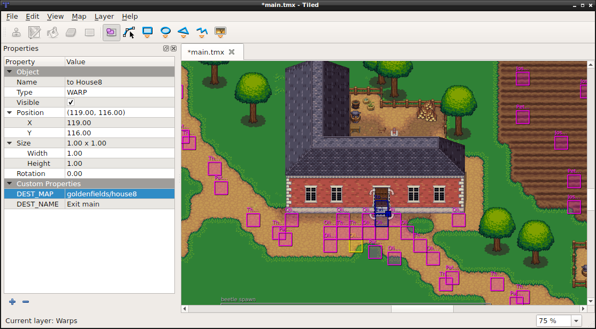
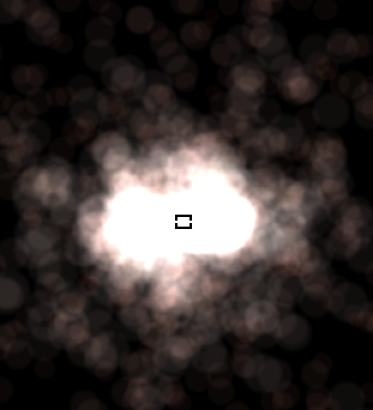
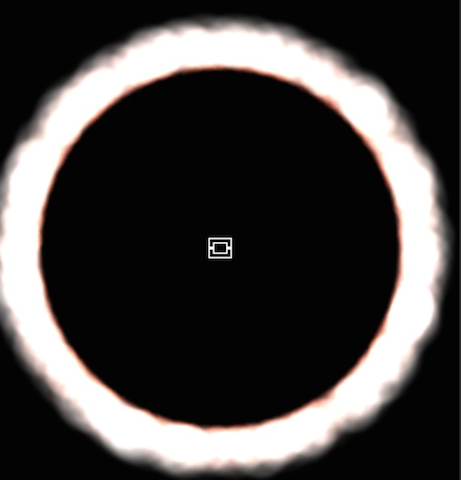

# Chapter 7: Other Node Types
You are using _sprites_, _labels_, _actions and your game is making progress.
Besides the basic `Node` types described in previous chapters, cocos2d-x also
provides more advanced `Node` types to help build special functionality. Perhaps
you want to make a tile-based game? Or maybe a _2d side scroller_? Or maybe you
want to add particle effects to your game? Cocos2d-x provides `Node` objects to
help you accomplish these goals!

## TMX
`TMX` is an XML-based map format originally designed for tile-based maps but
is also suitable for more generic game levels due to its support
for various object types. `TMX` objects are easy to create:
```cpp
// reading in a tiled map.
auto map = TMXTiledMap::create("TileMap.tmx");
addChild(map, 0, 99); // with a tag of '99'
```

Tile-based maps can have many layers, determined by a
z-order. You can access a specific layer by it's name:
```cpp
// how to get a specific layer
auto map = TMXTiledMap::create("TileMap.tmx");
auto layer = map->layerNamed("Layer 0");
auto tile = layer->tileAt(Vec2(1, 63));
```

Each tile has a unique position and id. This make is very easy to cherry pick
specific tiles. You can access any tile by it's id:
```cpp
// to obtain a specific tiles id
unsigned int gid = layer->tileGIDAt(Vec2(0, 63));
```

Example tiled-map layouts:




How do you make a tiled-map? There are many tools that do this. [Tiled](http://mapeditor.org)
is a popular tool. It is actively developed and has a great user community. The
screen-shots above are actual __Tiled__ projects.

## Particle System
Perhaps your game needs effects like burning fire, spell casting visuals or explosions.
How would you make such complex effects? Is it even possible? Yes, it is. Using
a _particle system_. The term _particle system_ refers to a computer graphics
technique that uses a large number of very small sprites or other graphic objects
to simulate certain kinds of __fuzzy__ phenomena, which are otherwise very hard
to reproduce with conventional rendering techniques. Some realistic examples
might include highly chaotic systems, natural phenomena, or processes caused by
chemical reactions. Here are a few examples of _particle effects_:

  

Building your own _particle effects_ is a rather complex process of setting
properties to achieve the desired effects. There are a lot of properties so let's
get familiar with some of the most basic ones. Don't worry, just keep this as a
reference to refer back to! Basic _particle_ properties include:

  >-startSize: Start size of the particles in pixels.

  >-endSize: Use kCCParticleStartSizeEqualToEndSize if you want that the start size == end size.

  >-startColor: (a ccColor4F).

  >-endColor: (a ccColor4F).

  >-life: time to live of the particles in seconds.

  >-angle: (a float). Starting degrees of the particle.

  >-positon: (a Vec2).

  >-centerOfGravity: (a Point).

Besides the properties each _particle_ has, the _particle system_ itself also has
properties that can be changed to achieve your desired effects. Some of these
include:

  >-emissionRate: How many particle are emitted per second?

  >-duration: How many seconds does the particle system live? Use kCCParticleDurationInfinity for infinity.

  >-blendFunc: The OpenGL blending function used for the system. (a ccBlendFunc).

  >-positionType: Use kCCPositionTypeFree (default one) for moving particles freely.
  Or use kCCPositionTypeGrouped to move them in a group.

  >-texture: The texture used for the particles. (a Texture2D).

### Particle System Modes
_Particle systems_ have two modes of operation. _Gravity Mode_ and _Radius Mode_.

#### Gravity Mode
_Gravity Mode_ lets particles fly toward or away from a center point. It's strength
is that it allows very dynamic, organic effects.



_Gravity Mode_ only have a few properties that you can change. They are:

  >-gravity: The gravity of the particle system.

  >-speed: The speed at which the particles are emitted.

  >-speedVar: The speed variance.

  >-tangencialAccel: The tangential acceleration of the particles.

  >-tangencialAccelVar: The tangential acceleration variance.

  >-radialAccel: The radial acceleration of the particles.

  >-radialAccelVar: The radial acceleration variance.

#### Radius Mode
_Radius Mode_ causes particles to rotate in a circle. It also allows you to create
spiral effects with particles either rushing inward or rotating outward.



_Radius Mode_ only have a few properties that you can change. They are:

-   startRadius (a float). The starting radius of the particles

-   startRadiusVar (a float). The starting radius variance

-   endRadius (a float). The ending radius of the particles.

-   endRadiusVar (a float). The ending radius variance

-   rotatePerSecond (a float). Number of degrees to rotate a particle around the source pos per second.

-   rotatePerSecondVar (a float). Number of degrees variance.

###How to create your particle?
There are two types of particle system in cocos2d-x: `CCParticleSystem` and `CCParticleSystemQuad`:

-   `CCParticleSystem`

-   `CCParticleSystemQuad`

`CCParticleSystem` extends from  `Node` and `TextureProtocol` in cocos2d-x, which means it shares all of the properties of it's super classes.

The `CCParticleSystemQuad` extends from `CCParticleSystem`. It includes all the features of ParticleSystem. Besides that, it has these additional features that `CCParticleSystem` doesn’t support:

- Particle size can be any float number.
- The system can be scaled
- The particles can be rotated
- It supports subrects
- It supports batched rendering since 1.1

####3 ways to create particles:

1. Create by `plist` file
2. Create by built-in particle examples
3. Create every property by yourselves

####Create by plist file
A `plist` file may contain all of the informations of a particle. And you can just create a particle system by a `plist` file.

```cpp
//Create by plist file
auto particleSystem = ParticleSystem::create("Particles/SpinningPeas.plist");

//Still you can modify the properties of particle if you need
//examples
// duration
particleSystem->setDuration(ParticleSystem::DURATION_INFINITY);

// radius mode
particleSystem->setEmitterMode(ParticleSystem::Mode::RADIUS);

// radius mode: 100 pixels from center
particleSystem->setStartRadius(100);
particleSystem->setStartRadiusVar(0);
particleSystem->setEndRadius(ParticleSystem::START_RADIUS_EQUAL_TO_END_RADIUS);
particleSystem->setEndRadiusVar(0);    // not used when start == end

// radius mode: degrees per second
// 45 * 4 seconds of life = 180 degrees
particleSystem->setRotatePerSecond(45);
particleSystem->setRotatePerSecondVar(0);
```


Spinning peas

So where can we define the plist file? We have so many particle tools. These tools allow you to new or modify your partilces visually (Like choosing your partilce's mode and you can see the effect in the editor immediately). Most of time, it is the best way to create particles. Here are some recommended tools below:

1. [Particle Designer](https://71squared.com/particledesigner): A very powerful particle effects editor on Mac
2. [V-play particle editor](http://v-play.net/2014/02/v-play-particle-editor-for-cocos2d-and-v-play/): A cross-platform particle editor for cocos2d-x
3. [Particle2dx](http://www.effecthub.com/particle2dx): An online web particle designer

####Create by built-in particle examples
Cocos2d-x comes with some predefined particles that can be customized in runtime. List of predefined particles:

-   ParticleFire: Point particle system. Uses Gravity mode.
-   ParticleFireworks: Point particle system. Uses Gravity mode.
-   ParticleSun: Point particle system. Uses Gravity mode.
-   ParticleGalaxy: Point particle system. Uses Gravity mode.
-   ParticleFlower: Point particle system. Uses Gravity mode.
-   ParticleMeteor: Point particle system. Uses Gravity mode.
-   ParticleSpiral: Point particle system. Uses Gravity mode.
-   ParticleExplosion: Point particle system. Uses Gravity mode.
-   ParticleSmoke: Point particle system. Uses Gravity mode.
-   ParticleSnow: Point particle system. Uses Gravity mode.
-   ParticleRain: Point particle system. Uses Gravity mode.

All of the effects can be found in the `cocos2d-x root/tests/cpp-test/Classes/Classes/ParticleTest/ParticleTest.cpp`.

```cpp
//------------------------------------------------------------------
//
// DemoFirework
//
//------------------------------------------------------------------
void DemoFirework::onEnter()
{
    ParticleDemo::onEnter();

    _emitter = ParticleFireworks::create();
    _emitter->retain();
    _background->addChild(_emitter, 10);

    _emitter->setTexture( Director::getInstance()->getTextureCache()->addImage(s_stars1) );

    setEmitterPosition();
}

std::string DemoFirework::subtitle() const
{
    return "ParticleFireworks";
}
```


Particle Fireworks

####Create every property by yourselves
In this way, you need to set all the properties of a particle.
```cpp
//------------------------------------------------------------------
//
// DemoRotFlower
//
//------------------------------------------------------------------
void DemoRotFlower::onEnter()
{
    ParticleDemo::onEnter();

    _emitter = ParticleSystemQuad::createWithTotalParticles(300);
    _emitter->retain();

    _background->addChild(_emitter, 10);
    ////_emitter->release();    // win32 : Remove this line
    _emitter->setTexture( Director::getInstance()->getTextureCache()->addImage(s_stars2) );

    // duration
    _emitter->setDuration(-1);

    // gravity
    _emitter->setGravity(Vec2::ZERO);

    // angle
    _emitter->setAngle(90);
    _emitter->setAngleVar(360);

    // speed of particles
    _emitter->setSpeed(160);
    _emitter->setSpeedVar(20);

    // radial
    _emitter->setRadialAccel(-120);
    _emitter->setRadialAccelVar(0);

    // tagential
    _emitter->setTangentialAccel(30);
    _emitter->setTangentialAccelVar(0);

    // emitter position
    _emitter->setPosition( Vec2(160,240) );
    _emitter->setPosVar(Vec2::ZERO);

    // life of particles
    _emitter->setLife(3);
    _emitter->setLifeVar(1);

    // spin of particles
    _emitter->setStartSpin(0);
    _emitter->setStartSpinVar(0);
    _emitter->setEndSpin(0);
    _emitter->setEndSpinVar(2000);

    // color of particles
    Color4F startColor(0.5f, 0.5f, 0.5f, 1.0f);
    _emitter->setStartColor(startColor);

    Color4F startColorVar(0.5f, 0.5f, 0.5f, 1.0f);
    _emitter->setStartColorVar(startColorVar);

    Color4F endColor(0.1f, 0.1f, 0.1f, 0.2f);
    _emitter->setEndColor(endColor);

    Color4F endColorVar(0.1f, 0.1f, 0.1f, 0.2f);
    _emitter->setEndColorVar(endColorVar);

    // size, in pixels
    _emitter->setStartSize(30.0f);
    _emitter->setStartSizeVar(00.0f);
    _emitter->setEndSize(ParticleSystem::START_SIZE_EQUAL_TO_END_SIZE);

    // emits per second
    _emitter->setEmissionRate(_emitter->getTotalParticles()/_emitter->getLife());

    // additive
    _emitter->setBlendAdditive(false);

    setEmitterPosition();
}
```


###CCParticleBatchNode

A `CCParticleBatchNode` can reference one and only one texture (one image file, one texture atlas). Only the `CCParticleSystems` that are contained in that texture can be added to the `CCSpriteBatchNode`. All `CCParticleSystems` added to a `CCSpriteBatchNode` are drawn in one OpenGL ES draw call. If the `CCParticleSystems` are not added to a `CCParticleBatchNode `then an OpenGL ES draw call will be needed for each one, which is less efficient.


## Parallax
A `Parallax` Node is a special `Node` type that simulates a _parallax scroller_.
What did you say? A _para_.. what? Yes, _parallax_ Simply put you can consider
a `ParallaxNode` to be a __special effect__ that makes it appear that the position
or direction of an object appears to differ when viewed from different positions.
Simple every day examples include looking through the viewfinder and the lens of
a camera. You can think of many games that function this way, Super Mario Bros
being a classic example. `ParallaxNode` objects can be moved around by a `Sequence`
and  also manually by mouse, touch, accelerometer or keyboard events.

Parallax nodes are a bit more complex than regular nodes. Why? Because they
require the use of multiple nodes to function. A `ParallaxNode` cannot function
by itself. You need at least 2 other `Node` objects to complete a `ParallaxNode`.
As usual, in true Cocos2d-x fashion a `ParallaxNode` is easy to create:
```cpp
// create ParallaxNode
auto paraNode = ParallaxNode::create();
```
Since you need multiple `Node` objects, they too are easily added:
```cpp
// create ParallaxNode
auto paraNode = ParallaxNode::create();

// background image is moved at a ratio of 0.4x, 0.5y
paraNode->addChild(background, -1, Vec2(0.4f,0.5f), Vec2::ZERO);

// tiles are moved at a ratio of 2.2x, 1.0y
paraNode->addChild(tilemap, 1, Vec2(2.2f,1.0f), Vec2(0,-200) );

// top image is moved at a ratio of 3.0x, 2.5y
paraNode->addChild(cocosImage, 2, Vec2(3.0f,2.5f), Vec2(200,800) );
```

OK, looks and feels familiar, right? Notice a few items! Each `Node` object that
was added is given a unique `z-order` so that they stack on top of each other.
Also notice the additional 2 `Vec2` type parameters in the `addChild()` call.  
