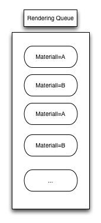

### How to create auto batch friendly GUI
Before we digging into the solution, let's first talk a little bit about
auto batch itself.

Currently, since Cocos2d-x v3.0beta, we have introduced a new renderer which is decoupled from
the Scene Graph and it also supports auto batch.

With the new renderer, Cocos2d-x does not issue OpenGL commands directly to graphic card but by
sending rendering commands.

Here is the overview of the new rendering architecture:

 


There are many built-in rendering commands in Cocos2d-x, I won't cover every rendering commands
here. If you are curious about them, please refer to the [Roadmap](https://docs.google.com/document/d/17zjC55vbP_PYTftTZEuvqXuMb9PbYNxRFu0EGTULPK8/edit#heading=h.fkk2up69ody1). 

Currently not every rendering commands could be batched, only *QuardCommand* and *TrianglesCommand* could be benefit from auto batch.

So when will these two rendering commands be batched?

>These two commands will have generated material ID by give textureID, glProgramstate
>and Blend function. If the these three requirements are identical, then these
>commands could be batched to save draw call.

One more important thing you should keep in mind that the batching commands must
be continuous, the renderer won't sort all these commands in the renderer queue.
And all rendering commands will be added to the render queue according to the scene
graph visiting order.

Here is a picture for illustrating.

 


For better illustration,suppose we have two images: *A.png* and *B.png*.

Here are some sample code:

1. 
```cpp
for(int i=0; i<1000; i++)
{
    auto sprite = Sprite::create("A.png");
    this->addChild(sprite,1);
}

for(int i=0; i<1000; i++)
{
    auto sprite = Sprite::create("B.png");
    this->addChild(sprite,2);
}
```

The first loop would create 1000 QuardCommands with the same material, the same blend func
and the same shader program. So the 1000 QuardCommands would be batched and only one draw
call would be made. The same goes for the second loop.

*Result:*
> The final draw call would be 2.

2.

```cpp
for(int i=0; i<1000; i++)
{
    auto sprite = Sprite::create("A.png");
    this->addChild(sprite,1);
    auto sprite2 = Sprite::create("B.png");
    this->addChild(sprite2,2);
}
```

Here we create two sprites in one loop and add them one by one to the scene graph, thus the
resulting rendering commands in the rendering queue would be like this:

 

*Result:*
> The final draw call would be 2000, no sprite would be batched.

In practical game development, it is common to add many sprites on the screen.
And the GUI widgets are also composed of many different sprites. If we could batch drawing
them, the game performance will boost.

So how to make your GUI scene(or generally other scenes) to be auto batch friendly?

If we pack *A.png* and *B.png* into a large sprite atlas and create sprite from
the sprite atlas, then the above 2nd code snippet could meet the three requirements
of auto batching and the final draw call could be reduced to one! What a big saving!

If you want to create auto batch friendly GUI, you'd better pack the sprites of
related GUI widgets into one large sprite atlas. And cocos2d-x would take the rest
work for you.

No big deal. You just need to group related sprites into spritesheet.

When you create GUI scene with CocosStudio, you should also consider the widget adding
order in the widget tree. If two widgets don't overlay visually, you should
organized them and make sure they are adjacent.

